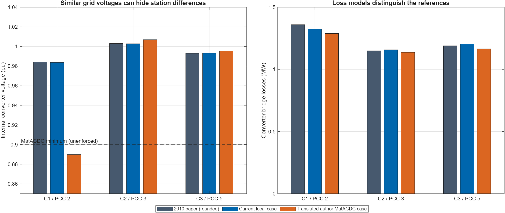

# Beerten 2010 and the author MatACDC case: two separate comparisons

Fresh verification: 2026-09-16. Scope: five AC buses, three DC terminals, no ULTC and no switched shunt. All powers below use PCC injection into the AC grid unless stated otherwise. The current solver uses the migrated PCC setpoint contract.

**The current reconstruction closely approximates the 2010 published results. A separate translation of the complete author MatACDC case reproduces the archived author solution to numerical tolerance. These are different station parameter sets.**

## Which author case exists?

The archived MatACDC 1.0 distribution supplies both [case5_stagg.m](../beerten_validation_batch6_20260911/reference/MatACDC1.0/Cases/PowerflowAC/case5_stagg.m) and [case5_stagg_MTDCslack.m](../beerten_validation_batch6_20260911/reference/MatACDC1.0/Cases/PowerflowDC/case5_stagg_MTDCslack.m). The DC file explicitly credits Jef Beerten and cites the 2011 PowerTech paper in lines 8–12. It has the same AC topology, generators at buses 1 and 2, converter PCCs at buses 2, 3 and 5, and a triangular three-node DC grid. C1 and C3 have fixed PCC P/Q; C2 controls DC voltage and its PCC AC voltage.

It is a complete, reproducible author benchmark. It should not be presented as the exact input file behind the filter-free 2010 paper: the later case includes a substantial transformer, filter and reactor. The [2010 paper](../../Referencias/Jef%20Beerten%20-%20A%20Sequential%20ACDC%20Power%20Flow%20Algorithm%20for.pdf) reports rounded output tables and does not specify all inputs needed to establish an exact reconstruction. See the earlier source audit in [batch-6 REPORT.md](../beerten_validation_batch6_20260911/REPORT.md).

## Current local case versus the 2010 paper

Fresh unified PF: **success=true, 3 iterations, no MATLAB warning**. Production input: [case5_vsc_mtdc_beerten.m](../../matpower/data/case5_vsc_mtdc_beerten.m), numerical data at lines 44–116. Capability enforcement was disabled for the unconstrained base power-flow comparison.

| Quantity | Paper | Current local case | Absolute difference |
|---|---:|---:|---:|
| C2 PCC active power, MW | 20.68 | 20.717616718 | 0.037616718 |
| C2 PCC reactive power, MVAr | 7.17 | 7.151766476 | 0.018233524 |
| C1 bridge loss, MW | 1.36 | 1.323785057 | 0.036214943 |
| C2 bridge loss, MW | 1.15 | 1.157808817 | 0.007808817 |
| C3 bridge loss, MW | 1.19 | 1.202968129 | 0.012968129 |
| C1 internal voltage, pu | 0.984 | 0.983706603 | 0.000293397 |
| C2 internal voltage, pu | 1.003 | 1.002843697 | 0.000156303 |
| C3 internal voltage, pu | 0.993 | 0.993155268 | 0.000155268 |

Across all buses/converters:

| Comparison | Maximum absolute difference |
|---|---:|
| AC bus voltage magnitude | 0.000240665 pu |
| AC bus voltage angle | 0.006551127 degrees |
| DC voltage magnitude | 0.000007778 pu |
| Internal converter angle | 0.002285564 degrees |
| DC power | 0.036216943 MW |
| Station passive active loss | 0.000003607 MW |
| Station net reactive consumption | 0.001215609 MVAr |

C1 and C3 reproduce their fixed PCC schedules (−60/−40 and +35/+5 MW/MVAr) to solver accuracy. That agreement is a control-equation check, not independent validation of the station parameters. C2 is the DC-voltage-balancing converter, so its active power is calculated and exposes the remaining difference in losses/DC-network behavior. It is distinct from the AC slack generator at bus 1.

All AC and internal voltage magnitudes lie within the paper's 0.001-pu printed precision. Several powers and angles differ by more than half of the paper's last printed digit; therefore the whole discrepancy cannot be attributed to rounding. The case is a close reconstruction, not a demonstrated exact replication.

## What changes in the complete MatACDC input?

This table compares the local reconstruction with the actual author case, not with unpublished 2010 inputs. C1/C2/C3 are ordered by PCC buses 2/3/5.

| Parameter | Current local reconstruction | Author MatACDC case |
|---|---|---|
| AC / DC voltage bases | 230 / 300 kV | 345 / 345 kV |
| Transformer impedance, pu | j0.0001 | 0.0015 + j0.1121, all stations |
| Filter susceptance, pu | 0 | +0.0887, all stations |
| Reactor resistance, pu | 0.0009615 / 0 / 0.000785 | 0.0001, all stations |
| Reactor reactance, pu | 0.0399 / 0.0392 / 0.0399 | 0.16428, all stations |
| DC resistance input, pu | 0.02633 / 0.02337 / 0.03601 | 0.052 / 0.052 / 0.073 with two poles |
| DC resistance translated to our equation | Same as local input | 0.026 / 0.026 / 0.0365 on the author voltage base |
| Bridge loss A, MW | 1.1033 | 1.103 |
| Bridge loss B, MW/pu-current | 0.1999949 | 0.148437591 after unit conversion |
| Bridge loss C, MW/pu-current², at this base point | 0.1466667 / 0.2222333 / 0.2222333 | 0.122411258 / 0.080795351 / 0.080795351 |
| AC branch ratings | 250 MVA | 100 MVA |
| G1 Pmin / Pmax | −500 / 500 MW | 10 / 250 MW |
| G2 Pmin / Pmax | 0 / 300 MW | 10 / 300 MW |

The AC per-unit branch R/X/B, loads, generator voltage targets, G2 scheduled 40 MW, and converter PCC schedules/control allocation agree. Generator Q boxes also agree. Ratings and generator P boxes do not change this unconstrained PF; they matter in a limit-enforced study. Base voltages must be respected when translating physical currents and loss coefficients: similar per-unit resistance numbers on different voltage bases do not imply equal physical ohms.

The author case additionally declares Imax=1.2 pu, Ucmax=1.1 pu and Ucmin=0.9 pu. These limits are not enforced in this comparison.

## Fresh translated author case versus archived author solver

The reproducible [MATLAB comparison](compare_references.m) loads the author inputs, builds a separate in-memory case for our solver and saves it in [comparison.mat](comparison.mat). It does not edit production code, either source case, or historical output. Our translated PF has **success=true, 4 iterations, no MATLAB warning**. The comparison target is the earlier successful author-solver run in [author_reference.json](../beerten_validation_batch6_20260911/author_reference.json), not a fresh author-solver execution.

| Quantity | Maximum absolute difference |
|---|---:|
| AC bus voltage magnitude | 4.28 × 10⁻¹³ pu |
| AC bus voltage angle | 6.00 × 10⁻⁹ degrees |
| PCC active power | 1.07 × 10⁻⁷ MW |
| PCC reactive power | 4.03 × 10⁻⁸ MVAr |
| Generator active power | 1.12 × 10⁻⁷ MW |
| Generator reactive power | 3.11 × 10⁻⁸ MVAr |
| AC branch P/Q components | 6.99 × 10⁻⁸ MW/MVAr |
| Internal converter voltage | 9.20 × 10⁻¹¹ pu |
| DC voltage | 2.22 × 10⁻¹⁶ pu |
| DC power | 1.37 × 10⁻¹² MW |

The translated solution has C2 PCC power **20.756601860 MW / 7.137161163 MVAr**. Its internal voltages are **0.889865474 / 1.006975085 / 0.995480993 pu**. C1's internal voltage is consequently very different from the local reconstruction's 0.983706603 pu, despite nearly identical grid-bus voltage magnitudes.

This verifies base-point equation equivalence for the complete station model. It does not establish equivalence of all limit transitions or continuation paths.

## Translation details and limits of the conclusion

1. **Pole factor:** archived [dcnetworkpf.m](../beerten_validation_batch6_20260911/reference/MatACDC1.0/dcnetworkpf.m), line 58, multiplies DC conductance power by `pol`. With two poles and matching AC/DC MVA and voltage bases, our total-network formulation therefore uses half the author's per-pole resistance. This is an equation/base conversion, not a fitted parameter.
2. **Loss units:** author coefficients use current in kA. At 100 MVA and 345 kV the AC current base is 100/(√3 × 345) kA. Multiply B by that base and C by its square for our pu-current formula. See archived [runacdcpf.m](../beerten_validation_batch6_20260911/reference/MatACDC1.0/runacdcpf.m), lines 310–314.
3. **Direction-dependent C:** the actual archived [calclossac.m](../beerten_validation_batch6_20260911/reference/MatACDC1.0/calclossac.m), lines 40–50, selects `LossCinv` for negative internal Pc and `LossCrec` for positive Pc. The translation follows that code exactly. Our matrix currently holds one C per converter; the translated fixed values are valid for these base-point directions. The script asserts that those directions remain unchanged. A general author-case replication across power reversal would need the two-coefficient switching model.
4. **Lower internal voltage:** C1 is below the author's 0.9-pu minimum. The archived author baseline and this comparison are unconstrained PF solutions. They are not certificates of equipment feasibility. Our current capability implementation does not yet enforce this lower internal-voltage boundary; adding it is separate work.
5. **Checks:** both success flags are asserted. Voltage, angle, generator and station output agreement assertions passed. MATLAB Code Analyzer reported zero findings for the final comparison script; calculations ran through MATLAB MCP using the initialized project. The exported figure was visually inspected. Full data are in [comparison.json](comparison.json), with per-converter CSVs alongside it.

**Recommendation:** retain the local 2010 reconstruction under that explicit name, and use a separately named MatACDC author-case translation as the fully specified numerical benchmark. Do not tune either case merely to erase discrepancies between two different published examples.
