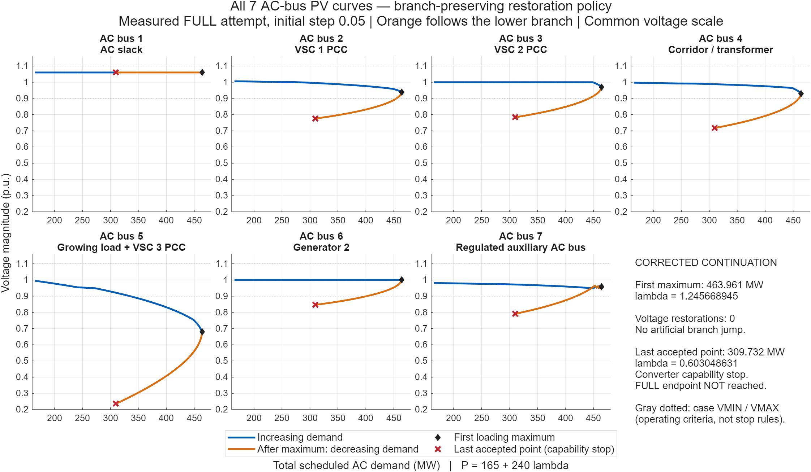
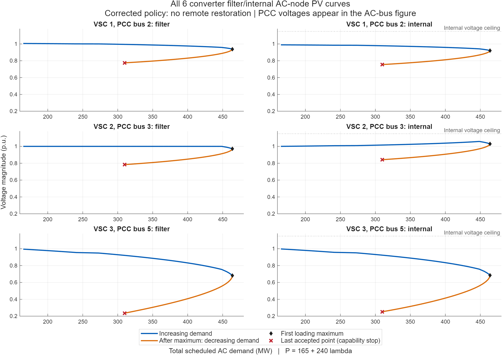
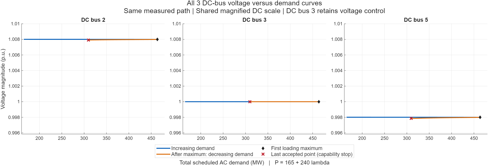

# Branch-preserving voltage-control restoration — 18 September 2026

The restoration jump has been removed. The rerun follows the decreasing-loading branch after the first maximum, without jumping to a separate voltage-controlled equilibrium. It still terminates at an existing converter capability restriction before the requested FULL endpoint. All figures below are measured accepted CPF points, not illustrative curves or extrapolation.

## What was wrong and what changed

The previous restoration code could solve a separate voltage-controlled power flow at the same loading and accept a different equilibrium. It also forced the resumed loading tangent negative. Neither operation establishes continuity with the incoming current-limited branch. The earlier apparent FULL completion using those operations is superseded by this verification; its files remain preserved as historical results.

The replacement in `matpower/lib/runcpf_vsc_mtdc.m` requires a local intersection of the current-limited and voltage-controlled equations:

1. Follow the current-limited branch until its PCC voltage meets the original voltage target. Locate a bracketed contact using the existing pseudo-arclength corrector.
2. Exchange the current constraint for the original voltage-control equation at that contact. A zero-length augmented correction must retain the same physical state within the specified numerical tolerance.
3. Orient the new tangent using its dot product with the incoming tangent. Do not impose a sign on its loading component.
4. Require two small, corrected forward steps to enter the current-feasible interior while satisfying the other enabled capabilities. An outward direction retains current control. An unresolved contact causes rollback and step reduction, with explicit unresolved termination at the minimum step.

The voltage contact tolerance is `max(1e-9, PF tolerance)` and the scaled state continuity tolerance is `max(1e-7, 10 * PF tolerance)`. The forward arclength probes are `1e-4` and `5e-5`, with locality and capability checks. Contacts coincident with another active-set change are retried rather than accepted speculatively. Successful releases record the contact, state gap, tangent orientation and both probe current ratios.

The old `current_release_margin` option remains accepted for compatibility but is ignored by this local policy. The result labels the policy `localized_branch_intersection`. This is a targeted correction using the existing solver, not a solver rewrite or a proof of global branch uniqueness or dynamic stability.

## Rerun results

The study ran with initial steps 0.10 and 0.05, NOSE and FULL stop requests, and restoration both enabled and disabled: eight runs. The physical bus, generator and loading traces were identical between enabled and disabled restoration for each matched pair. No admissible local restoration contact was found in this system's accepted trace, so there were zero release events. Separate fixtures demonstrate that genuine local inward releases do occur.

| Initial step | Request | First maximum λ | Last accepted λ | Reported cause | Requested endpoint reached |
|---|---|---:|---:|---|---|
| 0.10 | NOSE | 1.2456689439 | 1.2456689439 | `limit_induced_turn` | Yes |
| 0.10 | FULL | 1.2456689439 | 0.6030738127 | `vsc_capability_limit` | **No** |
| 0.05 | NOSE | 1.2456689454 | 1.2456689454 | `limit_induced_turn` | Yes |
| 0.05 | FULL | 1.2456689454 | 0.6030486306 | `vsc_capability_limit` | **No** |

Total scheduled demand is `PD = 165 + 240 λ` MW. In the plotted step-0.05 FULL run:

- First accepted loading maximum: **463.96055 MW**, λ = 1.2456689454.
- Last accepted point: **309.73167 MW**, λ = 0.6030486306; bus 5 voltage = **0.23570358 pu**.
- Accepted points: **90**. Restoration events: **0**.
- The maximum is classified as a **limit-induced turn**, not a demonstrated smooth saddle-node nose.
- The legacy success flag is 1 because a configured capability stop was handled. `requested_endpoint_reached=false` is the definitive FULL-completion result. `stability_margin_validated=false` remains explicit.

The lower branch is a mathematical continuation beyond operating criteria, not an acceptable operating trajectory. The final red cross marks the last accepted point before the capability stop, not a demonstrated collapse point or an exactly localized physical limit. No curve is drawn beyond it.

## All PV curves

The common horizontal axis is total scheduled AC demand in MW. Blue is the increasing-demand portion, orange the continuation after the first maximum. Diamonds identify the first maximum and red crosses the final accepted point. A multi-bus controlled system need not produce an identical textbook V shape at every node; the relevant requirement is continuity of the complete physical state through admissible equation changes.

### Seven AC network buses

### Six station filter and internal AC nodes

### Three DC buses

The DC plots use a magnified common voltage scale. Their nearly constant voltages are not evidence of a missing lower AC branch.

## Verification and reproducibility

MATLAB execution used MATLAB MCP after project initialization, following `.codex/MATLAB_MCP.md`. No CLI fallback or production-study solver relaxation was used.

| Verification | Result | Evidence |
|---|---:|---|
| Study, capability contacts, persistence, enabled/disabled equivalence and independent physical audits | **146/146 passed** | [Study evidence](verified/evidence.json), `tests/t_cpf_event_release.m` |
| Local release at a base contact, bracketed interior contact, and outward rejection | **23/23 passed** | [Local release evidence](verified_local/evidence.json), `tests/t_cpf_local_release.m` |
| Existing VSC/MTDC suite | **330/330 passed** | [Final suite log](t_vsc_mtdc_final.txt), `t_vsc_mtdc(1)` |

All eight final study runs and the three final release fixtures recorded no warnings. The maximum independent AC/DC/bridge balance error across the study runs was **9.4578e-7 MVA**. Physical-control acceptance, capability feasibility and load interpolation were checked at accepted points. The local fixtures use isolated fixed-control cases to exercise both release directions; they are not additional measured Beerten scenarios.

Preliminary fixture-construction failures and trial files are retained separately. They are not part of the passing verification set and were not MATLAB integration failures. The final study evidence is under `verified/`; the final release fixture evidence is under `verified_local/`.

Reproduction entry points are `tests/t_cpf_event_release.m`, `tests/t_cpf_local_release.m`, and `render_branch_preserving_pv.m` in this folder. Saved MAT files include the cases, options, result, success flag and warnings. The [plot summary](all_pv_curves/summary.json) identifies the plotted MAT file; [CSV data](all_pv_curves/all_voltage_traces.csv) includes every plotted voltage. MATLAB FIG files accompany the PNGs.

Pre-change source copies and hashes are retained in `before/` and `source_before.json`. `source_after.json` and `implementation_changes.patch` record the final source and the changes relative to those copies.

## Scope and remaining limitations

Generator 2's existing 187.5 MVA MBASE/Snom, 150 MW generic P maximum and 112.5 MVAr upper corner remain unchanged. Its exact P contact at λ = 11/24 is retained. The requested dispatch remains `40 + 240 λ` MW until P saturation; slack balancing, PQBRAK-off operation and enabled physical tap/shunt saturation are unchanged. Historical batch-6 margins are not used for this scenario.

The separate Q-first generator policy for increasing P along a capability boundary was not implemented by this branch-restoration correction. Nor was the later converter capability termination removed. Extending the accepted trace beyond that stop would require investigating that specific constraint and any admissible mode transition; it must not be achieved by selecting another equilibrium or forcing continuation through an infeasible state.

Use these corrected curves in place of the previous restoration-jump plots. The requested branch-preserving fix is implemented and verified; **the requested FULL endpoint is still not reached**, and the report makes no collapse claim.

Follow-up: [instrumented endpoint diagnosis](../cpf_endpoint_diagnosis_20260918/REPORT.md) identifies VSC 3 current activation and failure of its radial projection/re-correction loop. The last accepted point converges. The generic capability-stop label must not be read as proof that no feasible continuation exists.
