# Five changes to make capability-limited CPF reliable

This is a detailed design explanation, not an implementation. It expands the five recommendations from the 150 MW generator study. **No production code or case parameters were changed for this report.** The existing 150 MW study and historical outputs are preserved.

The central change is to treat a binding capability limit as part of the equations being solved. A capability curve describes the allowable operating region at a particular voltage; a limit-following power flow must solve the operating point and that voltage together. The other four changes make this usable in continuation, physically interpretable, coordinated with other controls, and auditable.

## What the diagnosis established—and what it did not

At the rejected loading λ = 1.24505833708, the present solver changes VSC 2's fixed Q from 143.721274 to 143.576376 MVAr. That reduction includes an unconditional 0.1% inward adjustment. The local fixed-Q branch's maximum loading moves from 1.245160630 to 1.245011208, below the attempted loading. An isolated simultaneous network/current-limit solve instead converges at Q = 143.720816 MVAr, with residual 2.08×10⁻¹² p.u. and accepted tap/shunt saturation policy.

That is evidence for a weakness in the current enforcement procedure. It is **not** proof that every subsequent loading has a feasible solution, that a descending branch is dynamically stable, or that a complete constrained CPF implementation has already been validated. The new proposals below are deliberately distinguished from the saved measurements.

| Proposed change | What it corrects | What it cannot guarantee |
|---|---|---|
| 1. Coupled capability equations | The limit moves with the solved station voltage and power | Feasibility when controls or ratings are genuinely exhausted |
| 2. Continuation during limit handling | Fixed-λ correction can become singular or lose its local root | Passage through every discontinuous control event |
| 3. Reserve on the physical current limit | A Q reduction is not a specified current reserve | Preservation of the original loadability with a stricter rating |
| 4. Coordinated active-set changes | One device's transition can invalidate other devices' constraints | A unique branch for arbitrary control policies |
| 5. Explicit events and termination evidence | A stopping label can conceal the real reason | Physical certification from a numerical success flag alone |

## 1. Solve the converter limit together with the network

### What happens now

The CPF corrector first obtains an electrical solution. A separate capability stage evaluates PCC P/Q at the current PCC voltage, projects the point into the capability region, writes new fixed setpoints, and solves another power flow at the same λ. If that voltage changes, the curve must be evaluated again. This is an outer fixed-point iteration around the electrical Newton solve.

The sequence is in `matpower/lib/runcpf_vsc_mtdc.m:1296`–1395. The fixed-Q equation itself is assembled in `matpower/lib/runpf_vsc_mtdc_unified.m:855`. The present full-station geometry is already available in `matpower/lib/vsc_station_map.m:12`–32 and `matpower/lib/vsc_station_capability.m:11`–16; it does not need to be replaced with another approximate circle.

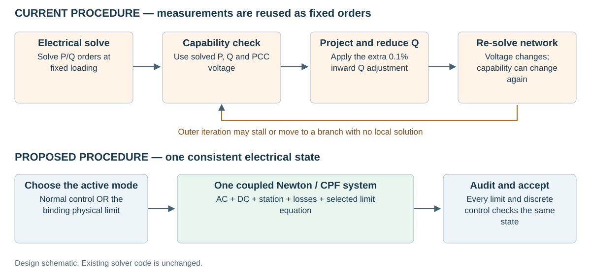

### What should replace that sequence

For one active converter limit, **replace one AC control equation with one physical limit equation**. The normal equation is either PCC voltage regulation or a specified PCC Q. On a current-limited branch, the replacement equation says that actual internal converter current equals its selected limit. Q becomes a solved consequence of the network state, rather than a number clipped using the previous voltage.

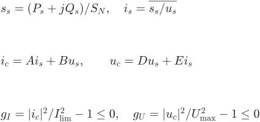

Here the complex PCC power s is per unit on the converter capability base S_N; voltage phasors use the station voltage base, and currents use the corresponding S_N base. A, B, D and E are the existing station-map coefficients, including transformer/reactor series impedances, filter admittance, charging and transformer phase shift. Parameters are held fixed during an electrical Newton solve. After a discrete equipment change the map/network must be rebuilt as needed. This formulation remains well defined as station impedances tend to zero; the explicit network representation still has its existing nonzero-impedance requirements.

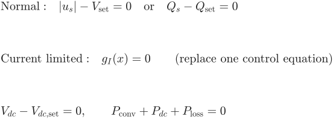

For VSC 2, **DC-voltage regulation must remain intact**. Its AC P adjusts to DC-network balance and losses. “Preserve P” must not be interpreted as pinning the DC-voltage controller's calculated P to its previous numerical value. The AC voltage/Q request is the control being sacrificed. The conventional AC slack generator remains responsible for AC reference angle and AC balancing; it does not replace the converter's DC-voltage equation.

For a non-DC-slack PQ converter under active-power priority, the P order can remain while Q adjusts to the boundary. Under a reactive-support priority, it may instead be the P order that is relaxed. That is a declared control policy, not a choice Newton's method should make implicitly.

### Keep the nonlinear system square

Adding a current equality while retaining every old voltage and power equality generally overconstrains the converter. Equation replacement preserves the available degrees of freedom. A clean design keeps the user's requested controls and schedules separate from a solver-owned active-limit state: “normal,” “current-limited,” or “internal-voltage-limited.” This avoids losing the original requested Q/V when recovering from saturation.

If the internal-voltage upper limit binds first, use its equality instead of the current equality. Audit both inequalities after each solve. At an intersection where two independent limits must bind simultaneously, check whether another controllable variable is available. Two equalities cannot normally replace one control equation without an additional released control or variable. Depending on the declared policy, active-power redispatch, another balancing converter, or an explicit infeasibility termination may be needed. This is especially important for the DC-voltage controller; silently releasing its DC-voltage equation is not a valid general solution.

### Include the boundary derivatives in Newton's method

The boundary must respond to changes in voltage and power within each Newton update. The station map gives simple analytic differentials:

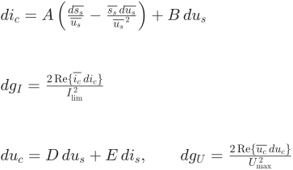

The same chain rule connects these differentials to the solver's angle/magnitude and DC variables. Alternatively, the already assembled station branch admittance rows can provide the internal-current derivatives directly from AC voltage phasors. Keep power/current bases consistent and include the existing loss derivatives in the bridge equations. The diagnostic prototype used central differences for the added current row; that is evidence of feasibility, not the recommended final production Jacobian.

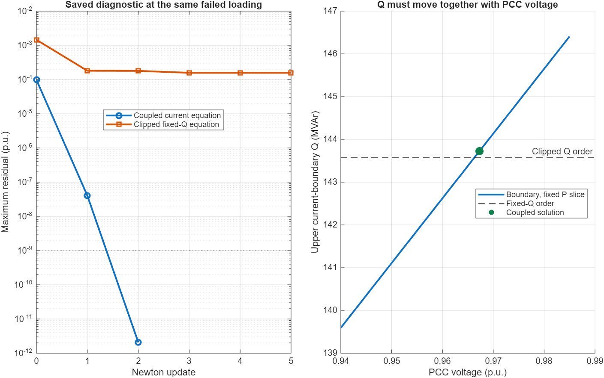

The left panel uses saved iteration histories at the identical failed λ. The right panel is a derived fixed-P slice of the full-station current boundary for this particular filter-free station. It explains why choosing Q independently of voltage can be inconsistent. No additional production run is represented by that slice.

**Validation gate:** reproduce the existing unconstrained PF; satisfy the exact current/voltage constraints on a limited branch; compare analytic boundary derivatives with independent finite differences; verify PCC/internal powers and AC/DC balances. Test both directions of power transfer, nonzero filters, transformer/reactor losses, and zero/tiny-impedance map limits. A solve at one limiting point is only the first test, not a full CPF acceptance criterion.

## 2. Keep continuation active near folds and limit transitions

### Why the current fixed-λ re-solve can fail

The normal CPF already has an augmented Newton corrector. But capability settlement calls a separate fixed-λ PF (`runcpf_vsc_mtdc.m:1332` and `:3575`). This temporarily discards the continuation degree of freedom precisely when the network is most sensitive.

For a fixed active set a, write the electrical/control equations as F_a(x,λ)=0. Near a simple saddle-node fold, the fixed-λ Jacobian F_a,x becomes singular. This does not necessarily mean the solution curve ends: its tangent may simply have zero loading component. A continuation parameter that measures distance along the curve can still identify the next point.

The standard augmented corrector and pseudo-arclength parameterization are described in the primary [MATPOWER parameterization documentation](https://matpower.app/manual/matpower/Parameterization.html) and [corrector documentation](https://matpower.app/manual/matpower/Corrector.html). The matrix below specializes that framework to the proposed active-limit equations; it is not a claim that stock MATPOWER implements this project's converter policy.

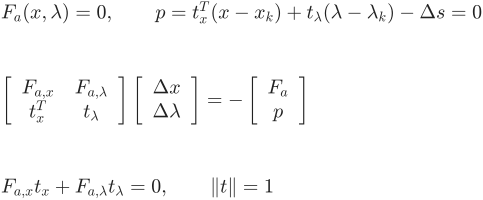

The state vector contains the project's electrical unknowns; λ is also solved. The last row selects the next point using the previous tangent t and step Δs. In production, scaling matters because the state mixes radians, voltage per unit and power variables. Reuse or explicitly document the existing scaling and normalization; do not introduce a new metric silently.

### How a transition should be handled

Bracket the first capability crossing on the current branch and locate it by solving the old branch together with the event condition. At a continuous control release, build the new active-limit equation at that event, remap the state if its layout changes, and compute a new tangent. Then correct a predictor on the new branch with the augmented equations. Choose tangent orientation consistently with the incoming branch so a sign convention does not accidentally reverse the trace.

The existing corrector at `runcpf_vsc_mtdc.m:3631` and tangent builder at `:3662` provide much of the algebraic machinery. The proposed work is to carry that machinery through the active-set stage instead of repeatedly jumping to a fixed-Q PF at the old λ.

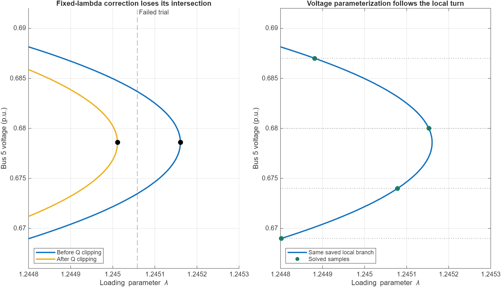

These panels are from the saved voltage-parameterized branch diagnostic. A vertical fixed-λ line can stop intersecting a changed fixed-Q branch. Horizontal voltage slices still identify points through a simple voltage fold. Production pseudo-arclength uses the full state, not necessarily bus 5 alone; bus 5 is used here because it makes the geometry visible.

### Boundaries of this proposal

Letting λ vary is not permission to evade a requested operating condition. If the user asks for a PF at a specific λ, report whether that exact loading can be solved. For CPF, an event must remain anchored and correctly ordered; do not silently move a tap action or skip an earlier generator limit just because a later point converges.

A discrete tap/shunt move can change the equations discontinuously. Attempt electrical settlement at the event loading under the declared policy. If no connected feasible branch is found, distinguish that control-induced termination from an ordinary smooth fold. A limit-induced bifurcation is a real possibility. Pseudo-arclength improves continuation through regular folds; it cannot manufacture a feasible network or guarantee passage through higher-order singularities.

**Validation gate:** trace a known smooth fold in both NOSE and FULL modes; reduce step size and compare event loading and mode sequence; verify tangent consistency before and after switches; distinguish continuous limit releases from discrete equipment jumps. Confirm that FULL follows its declared endpoint criterion rather than stopping at the first small loading derivative.

## 3. Define any reserve on current, not on a Q percentage

### Three different concepts need separate settings

An **equipment rating** is the allowed current. An **operating reserve** deliberately tightens that rating. A **numerical tolerance or switching hysteresis** controls how close a residual must be to zero, or when modes switch. These serve different purposes and should not be represented by the same unconditional Q reduction.

The current code defaults to a 0.001 inward fraction in `runcpf_vsc_mtdc.m:1694`. For the P-preserving projection it scales Q at `:1632`–1634. This moves the operating point inside the curve evaluated at the previous voltage; it does not define a fixed current reserve at the newly solved voltage.

### A physically interpretable alternative

If the study requests a current reserve ε_I, set an effective current limit and solve that boundary simultaneously with the network. A study with zero reserve should follow the actual equipment boundary within numerical tolerance. A positive reserve is an intentional change to the feasible region and can reduce loadability; that consequence must remain visible.

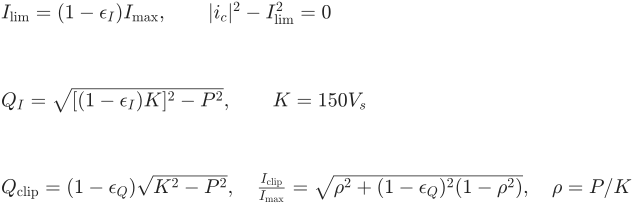

The last two formulas describe the filter-free station at **fixed PCC voltage**. K = 150 V_s is its PCC apparent-power circle radius in MVA, and ρ is its active-power share. The formula is a derived illustration; a station with a filter uses the full affine current map rather than a circle assumed to be centered at zero.

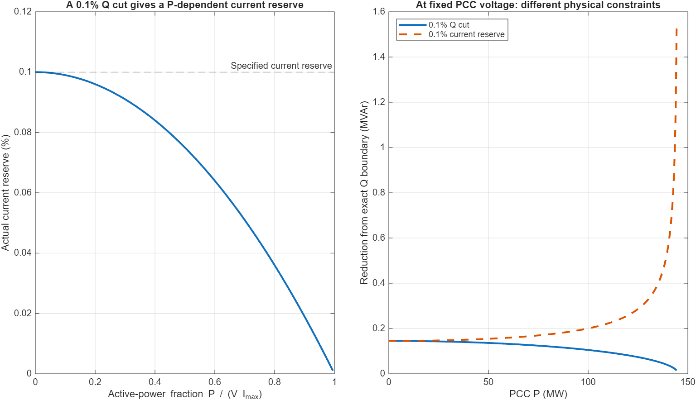

At the saved operating P, a 0.1% Q reduction produces approximately **0.0981% current reserve** if voltage is held fixed. At ρ = 0.8 it produces only **0.0360%**, and at ρ = 0.99 only about **0.0020%**. Thus the near agreement at the saved low-P/high-Q point is coincidental. As P approaches the current-limited maximum, there may be no remaining Q adjustment capable of delivering the requested reserve while preserving P.

In a full network, voltage also moves. A smaller current limit can lower Q, which can lower voltage further. Simultaneously solving the tightened boundary makes that coupling explicit; it does not remove the physical feedback or promise convergence. If P alone exceeds the tightened feasible range, report the need for an authorized P/control change or terminate under the declared policy.

### Avoid turning hysteresis into hidden derating

Use small, documented residual tolerances for activation and a distinct recovery test for release. A converter already on its current equality has zero current margin by construction; that alone cannot decide whether it should return to voltage control. Predict or temporarily solve the original requested control and verify that it would lie sufficiently inside all capability limits before releasing the active limit. Keep hysteresis separate from physical reserve in output metadata.

**Validation gate:** verify the specified current reserve at low/high P, positive/negative Q, and with filters; reject an impossible P-preserving reserve honestly; test recovery without mode chatter. Confirm that a zero-reserve limit does not inherit the old 0.1% Q jump.

## 4. Coordinate generator, VSC, tap and shunt transitions

### The controls are coupled through one electrical state

The generator regulates its bus voltage by changing Q until its capability binds. The VSC similarly exchanges reactive power to meet its PCC voltage request, subject to its station limits. A tap changes the network voltage relationships and current distribution. A shunt changes susceptance, with actual Q proportional to V². Each device's action changes the voltages used by the others.

The present code already recognizes this: after a generator transition it settles PSS/E controls and VSC capability again (`runcpf_vsc_mtdc.m:1870`–1898). That handoff is valuable. The proposal is to make the continuous limit equations coherent within the shared solve, and to make event ordering and rollback explicit—not to remove existing coordination.

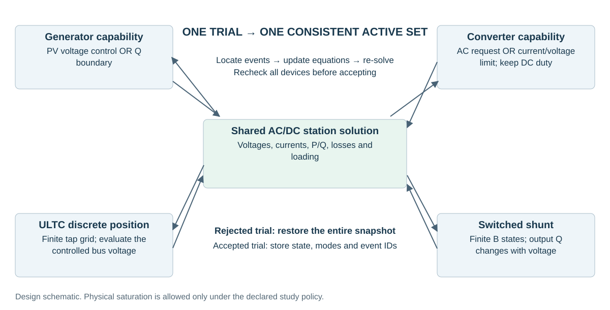

### Generator PV to Q-limited behavior

The current 150 MW generator's generic thermal curve has an upper corner of 112.5 MVAr. In normal PV mode it adjusts Q to hold its voltage request. When the applicable capability boundary binds, fix Q to that boundary and release the voltage target. If the boundary depends on P, its derivative must participate in the limited equation when P is a solved variable. At this study's fixed P = 150 MW corner, Qmax = 112.5 MVAr is constant.

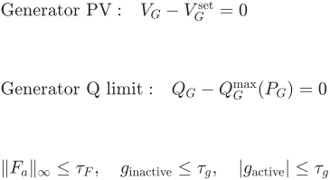

In formulations that eliminate some variables in PV mode, switching to PQ changes the state layout. That requires explicit index/state mapping and a rebuilt tangent. A fixed-dimension formulation with explicit generator Q is another design option, but it is a larger architectural change and not necessary for the first bounded implementation.

### One coordinated step, in practical terms

1. Snapshot the last accepted electrical state, schedules, active limits and discrete positions.
2. Predict on the current active set. Evaluate all candidate event functions on that same predicted/corrected state.
3. Locate the earliest crossing; group genuinely simultaneous events within a declared event tolerance rather than imposing an arbitrary generator-first or VSC-first answer.
4. Apply the permitted continuous control releases and solve the coupled equations. Re-evaluate discrete tap/shunt requests using the resulting full-model voltages.
5. If a discrete position changes, update the network and solve again under the same declared device policy. Detect repeated mode/position signatures rather than iterating indefinitely.
6. Accept only when electrical residuals, active-limit equalities, inactive inequalities, DC regulation and discrete-control settlement all pass. Otherwise roll back the whole trial, including metadata, and reduce the continuation step or report the actual failure.

The inequalities in the acceptance equation use normalized, dimensionless margins or clearly documented units. Device-specific tolerances may differ; do not compare raw MW, per-unit current and voltage residuals as if their numerical scales were interchangeable.

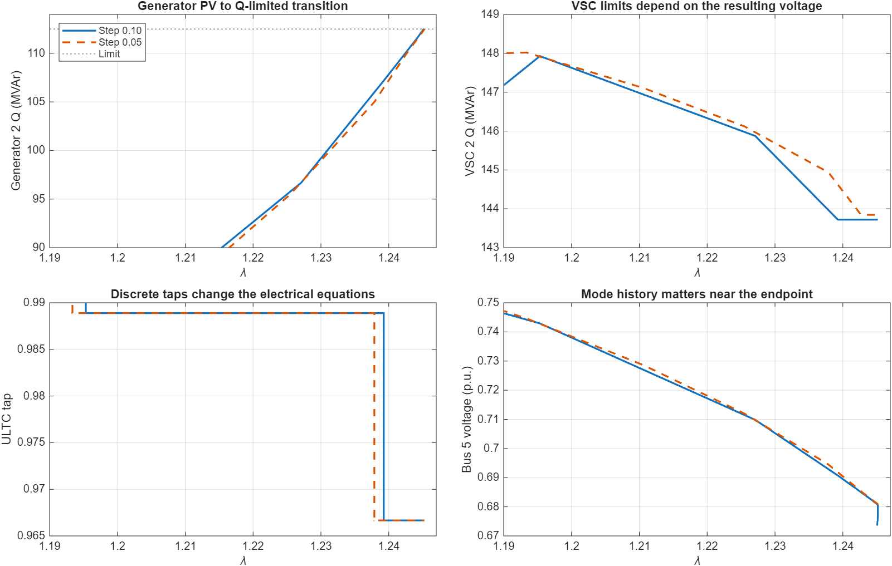

In the saved 0.10-step run, generator 2 becomes PQ and later VSC re-correction fails. In the 0.05-step run, the generator remains PV at the final accepted point, Q = 112.48250 MVAr; the next candidate requests 112.51648 MVAr and the generator-limit correction fails. The device limits are the same, but the saturated-Q history differs. Smaller steps alone therefore do not establish a robust physical margin.

### Recovery and competing limits

Recovery should test whether the original control request is again feasible, with a small declared hysteresis. It should not permanently lock a controller merely because it reached a physical bound once. Conversely, never release a limit just because the equality residual is small. For multiple limits on one device, check equation count and control priorities before selecting an active set; adding all equalities blindly is not coordination.

If two devices compete for voltage control at the same bus, keep the existing sharing/control policy explicit. The proposed coupled solve does not by itself define reactive sharing, redispatch participation or optimization. Those are separate study decisions.

**Validation gate:** trigger each transition alone, then generator/VSC transitions close together, then tap/shunt interactions. Verify no accepted violations or unexplained order dependence, correct rollback, and reproducible mode histories under step refinement. Retain independent audits from physical currents/phasors rather than only checking the projection's own return flag.

## 5. Make event and termination reports describe what actually happened

### A success flag needs a scope

There are at least four independent questions: Did the electrical equations converge? Did the controls and device constraints settle? Did the requested CPF endpoint complete? What evidence supports any claimed physical boundary? One boolean cannot answer all four.

The project already stores `success_scope`, `requested_endpoint_reached`, and `stability_margin_validated`; preserve that useful distinction. Expand the failure record to identify the inner stage, rather than interpreting every capability-stage failure as a physical capability boundary.

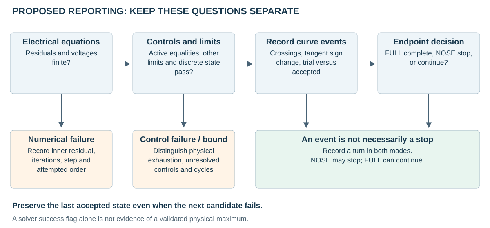

### Record a turn even when FULL continues

In the saved main run the loading tangent changes sign, λ reaches 1.24516063122, and 75 subsequent accepted steps have decreasing λ. Yet `nose_detected` is false because the event test is gated on `stop_at = 'NOSE'` (`runcpf_vsc_mtdc.m:837`–839), and the flag is inferred from an event named NOSE (`:974`).

Detection and stopping should be separate. Detect and localize the turn in either mode; NOSE may stop there, while FULL continues. Record the event's active set and whether it is an accurately localized event or merely a sampled maximum. A turn on a frozen-Q branch is not automatically the maximum of the full limit-following system.

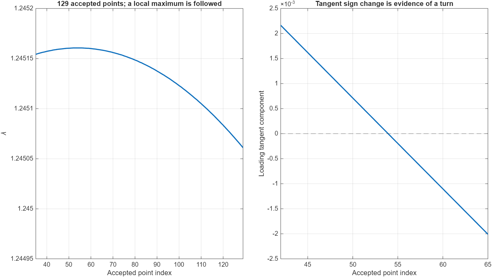

### A useful failure record

| Field | Why it matters |
|---|---|
| Last accepted point and failed candidate | Keeps a rejected trial out of the accepted operating trace |
| λ, step and active-set signature before/after | Shows where and under which control equations the problem occurred |
| Device identity and measurement terminal | Distinguishes generator 2 at bus 6 from VSC 2 at PCC bus 3 |
| P/Q, V_PCC, internal current/voltage and normalized margins | Shows the actual physical constraint and its severity |
| Requested control, projected order and reserve policy | Reveals finite setpoint jumps or hidden derating |
| Inner residual, iterations and line-search outcome | Distinguishes electrical failure, stalled progress, iteration limit and NaNs |
| Control settlement, cycles and available discrete positions | Separates exhausted equipment from an unresolved control loop |
| Event bracket and localization residual | Prevents a nonzero-margin estimate from being called the exact crossing |
| Tangent loading sign, localized turn and requested endpoint | Separates local curve geometry from completion of FULL |

Keep trial-attempt identifiers as well as accepted-point indices. Several rejected attempts can belong to the same next CPF step. Previously, raw control-event counts included rejected trials; accepted tap movements should be reconstructed only from accepted states, or from explicitly accepted event records.

Useful terminal categories include “requested endpoint reached,” “physical device bound accepted,” “control branch could not be continued,” “electrical correction failed,” “active-set cycling,” and “iteration/step budget exhausted.” A physical infeasibility claim requires stronger evidence than Newton failure alone. A `configured_stop_policy` success should remain visibly different from FULL completion.

**Validation gate:** intentionally provoke each failure class and check its record; confirm the last accepted solution is preserved; verify FULL records a turn without stopping; compare logged physical margins with an independent recomputation. A reporting fix is low risk and can be delivered independently of the numerical reformulation.

## A bounded implementation sequence

| Order | Deliverable | Acceptance before proceeding |
|---|---|---|
| A | Add diagnostic records and separate turn detection from stopping | Existing numerical trajectories unchanged; known failure stages and FULL turn recorded |
| B | One VSC current-limited equation with analytic derivatives | Reproduce the saved failed-trial coupled solution; all physical balances and other constraints pass |
| C | Integrate the limited mode into the CPF corrector/tangent | Continuous limit crossing and a simple fold traced with consistent event locations |
| D | Coordinate generator/discrete controls and recovery | Event interactions, rollback and step-refinement behavior validated |
| E | Expose optional physical current reserve | Explicit study choice; reserve verified at the solved state; no hidden Q scaling |

Start with the demonstrated VSC 2 current limit, then extend to the internal-voltage boundary and other priority modes. Leave unsupported multi-limit combinations explicit until their degrees of freedom and dispatch policies are designed. Compare results against the existing regression baseline and saved trajectories; do not overwrite the historical reference runs.

The key outcome to seek is not merely “the solver runs longer.” It is a trace whose equations match the declared controls, whose accepted points satisfy every implemented physical constraint, and whose stopping reason can be explained from evidence.

## Evidence and scope

New work here consists of explanatory diagrams, derived reserve comparisons and figures made with MATLAB MCP from saved results. No production CPF was rerun and no production code or case was modified. Five new plot files and six equation figures are generated by `make_figures.m`; calculations are recorded in `new_calculations.json`. The SVG diagrams label proposed behavior rather than measured executions.

Saved source data: `outputs/ultc_swshunt_g2_150mw_20260916/main_run.mat`, `half_step_run.mat`, `coupled_boundary_probes.mat`, and `frozen_Q_folds.mat`. These remain the numerical evidence for the diagnosed case. The earlier report provides the full run audit and instrumentation details. MATLAB's rendered equations and scientific plots are embedded in the standalone HTML, together with an interactive fixed-voltage reserve comparison. That comparison is algebraic, not a live network power-flow calculation.

Verification: all five scientific plots, six rendered equation figures and three engineering schematics were visually inspected as saved images. The HTML's embedded images and navigation anchors were checked structurally. Browser security policy blocked the local HTML preview, so complete page layout and live slider interaction were not browser-verified. The source hashes shared with the preceding study remain unchanged.
