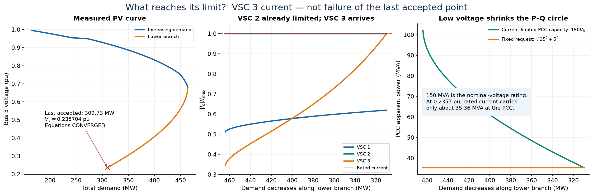
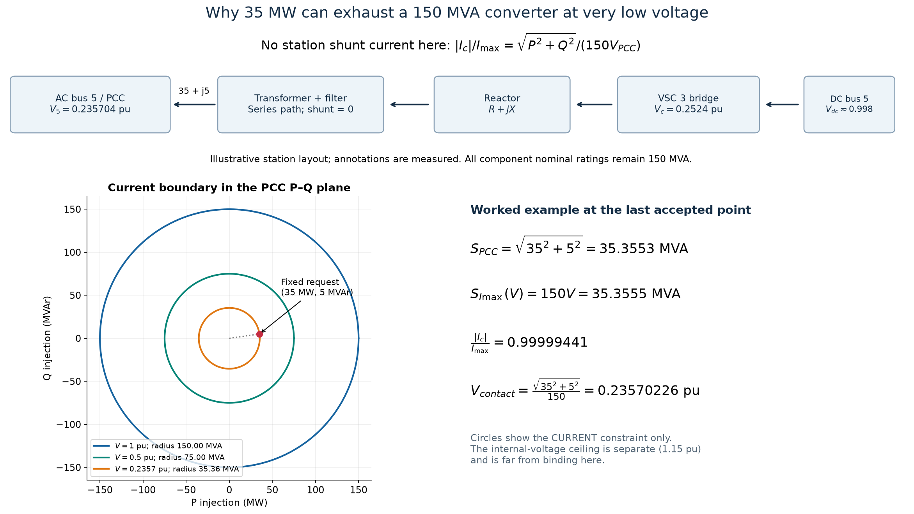
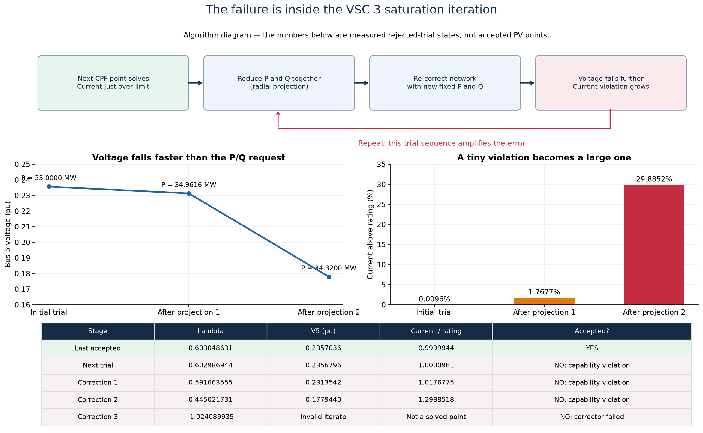

# Why FULL CPF stops near λ = 0.60305

**The last plotted point converges. The next converter-current transition fails to settle.** A real VSC 3 current restriction triggers the transition, but its numerical failure does not prove loss of equilibrium. The earlier “converter capability stop” description was accurate as a software label but did not identify the failing saturation iteration.

No production code, rating, case, dispatch policy or solver setting was changed. An instrumented copy reproduces the original accepted loading and converter traces exactly and records the rejected trials.

## The last accepted point is solved

| Quantity | Measured value |
|---|---:|
| Loading λ | 0.603048630617 |
| Total demand | 309.731671 MW |
| Bus 5 / VSC 3 PCC voltage | 0.235703577 pu |
| VSC 3 current / rated current | 0.999994414 |
| VSC 3 PCC P, Q | 35 MW, 5 MVAr |
| Maximum electrical equation mismatch | 7.2487 × 10⁻¹² |
| FULL endpoint reached | No |

VSCs 1, 2 and 3 have current/rating ratios of 0.61982045, 1.00000000 and 0.99999441. VSC 2 already follows its current boundary; VSC 3 is just about to reach its own.

## Why 35 MW almost exhausts a 150 MVA station

The nominal MVA rating defines rated current at nominal voltage. It does not permit the same MVA at every voltage. In this station the transformer/filter/reactor shunt terms are zero, so the full station map gives the same series current magnitude at the PCC and converter. On the 150 MVA converter base:

$$
\frac{|I_c|}{I_{\max}}=\frac{\sqrt{P_{PCC}^2+Q_{PCC}^2}}{150V_{PCC}},\qquad
P_{PCC}^2+Q_{PCC}^2\leq(150V_{PCC})^2.
$$

At the last accepted voltage, the current circle has radius **35.3555 MVA**. The fixed request is already √(35²+5²) = **35.3553 MVA**. The exact voltage at which this unchanged request reaches the circle is

$$
V_{contact}=\frac{\sqrt{35^2+5^2}}{150}=0.2357022604\;\mathrm{pu}.
$$

This is a contact voltage, not a solved contact λ. The saved endpoint is just above it. All component ratings remain 150 MVA: no reactor/converter rating discrepancy causes this stop. Internal converter voltage is 0.2524 pu, far below its separate 1.15 pu ceiling.

For stations with nonzero shunts, use the full affine station map rather than this simple circle. It is exact for the current geometry here; the numerical audit uses the actual `vsc_capability_curve` implementation.

## What the next attempted step does

At the smallest attempted arclength step, 0.0001953125, the ordinary corrected candidate is λ = 0.602986944002. Its residual is 8.3085 × 10⁻¹³, but VSC 3 current is 1.000096081 times its rating: **0.0096081% over**.

VSC 3 is fixed-PQ at the PCC and has default `radial` capability projection, selected by its fixed-PDC control category. Radial projection scales P and Q together, retaining Q/P = 1/7. The implementation projects at the candidate voltage, applies a **0.1% inward setpoint margin**, then solves the network again with those **new fixed P and Q values**. The transition retains the incoming CPF hyperplane and lets λ vary.

Solving again changes voltage. A pair feasible at the old voltage can violate the current constraint at the new voltage. The final attempted step contains this measured sequence:

| State | λ | V5 pu | P3 MW | Q3 MVAr | Current/rating | Outcome |
|---|---:|---:|---:|---:|---:|---|
| Ordinary next candidate | 0.602986944 | 0.235679616 | 35.000000 | 5.000000 | 1.00009608 | Electrically solved; current violation |
| First projection and correction | 0.591663555 | 0.231354177 | 34.961641 | 4.994520 | 1.01767748 | Electrically solved; larger violation |
| Second projection and correction | 0.445021731 | 0.177943955 | 34.319988 | 4.902855 | 1.29885179 | Electrically solved; much larger violation |
| Third correction attempt | −1.024089939 | Invalid iterate | — | — | — | Corrector fails; rejected |

The first two transition corrections have residuals 1.3452 × 10⁻¹² and 8.5154 × 10⁻¹⁰. Initially the problem is consistent capability enforcement, not solving the network equations. The third correction leaves the admissible voltage domain. Its reported residual, about 1.4142 × 10⁶, comes from an invalid-voltage penalty, not a physical MW mismatch.

Negative trial λ is a **rejected Newton iterate**, not a solved negative-demand point or another valid branch. None of these corrections is appended to the accepted PV trace. The previous restoration-jump fix remains in effect.

The solver retries smaller outer steps. Halving the last trial again would give 0.00009765625, below `step_min=0.0001`, so it stops and returns the previous accepted point. The finite inward P/Q margin remains when the outer step shrinks. Smaller steps alone do not establish a consistent saturation transition.

This is feedback within a numerical algebraic iteration, not a simulated dynamic control instability or a physical collapse trajectory.

## Implementation gap versus policy choice

The simultaneous current equation activates only for a current violation with `preservar_p` projection and unchanged P. VSC 2 qualifies. VSC 3's `radial` policy does not, so it still uses the outer projection/re-correction loop.

That is an **implementation gap** separate from the **modeling choice** of P/Q allocation. A targeted candidate improvement retaining radial allocation would solve the network and current boundary together:

$$
F_{network}(x,\lambda,\alpha)=0,\quad
P_3=35\alpha,\quad Q_3=5\alpha,\quad
|I_{c3}(x,\alpha)|=I_{\max}.
$$

Here α is the retained fraction of the request, normally 0 ≤ α ≤ 1 for this derating rule; entry contact has α = 1. The transition needs solved contact location, physical continuity and an admissible outgoing direction. A solution requiring α > 1 or violating another bound cannot simply be accepted. **This diagnostic has not solved that alternative system or proved an admissible outgoing branch exists.**

Preserving P and reducing only Q would be a different policy. It should not be silently substituted to obtain continuation. Even that policy eventually encounters the P/current restriction as voltage falls.

## Other controls at this point

- Generator 2 is at 150 MW and 112.5 MVAr, with no upward headroom under its present curve.
- The transformer tap is at its 0.9 bound.
- Bus-5 shunt susceptance is at its maximum, 15 MVAr at 1 pu. Actual injection is **15 × V5² = 0.83334 MVAr**.
- VSC 2 is already current-limited; VSC 1 remains below rated current.

These facts explain why the other controls do not restore bus 5 to target. They do not prove the failed VSC 3 transition is a loss of equilibrium.

## Reporting and recommendations

The existing output says `vsc_capability_limit`, legacy `success=1`, and `requested_endpoint_reached=false`. The diagnostic identifies the mechanism more specifically: **VSC 3 current activation followed by failed radial capability settlement**. Treat it as an unresolved capability transition, not a certified physical boundary or collapse point.

Recommended focused work:

1. Locate VSC 3 current entry with a solved event, replacing reliance on a linear-margin event estimate.
2. Implement and test simultaneous radial boundary following if retaining the current P/Q rule; check entry/release continuity and feasible direction.
3. Report converter identity, triggering constraint, pre/post-transition residuals, and accepted versus rejected λ separately. Distinguish numerical settlement failure from an orderly stop at a validated limit.
4. Rerun the unchanged study. Do not relax ratings, disable capabilities, force the λ direction or claim λ = 0 is reachable without evidence.

No policy change is needed to investigate a better numerical realization of the existing radial rule. Changing to P priority would require an explicit modeling decision. No such change was made here.

## Evidence and reproducibility

Primary project evidence: [numerical diagnostics](evidence.json), `instrumented_run.mat`, and the original saved `full_050_release1.mat`. `build_instrumented_copy.py` creates isolated copies with renamed entry points and diagnostic snapshots only. `instrumentation_provenance.json` records the production solver hash. The verified copy retains the PSS/E-aware wrapper preparation.

Relevant production locations, relative to project root:

- `matpower/lib/runcpf_vsc_mtdc.m:1731`: coupled-current eligibility excludes radial projection.
- `matpower/lib/runcpf_vsc_mtdc.m:2097` and `:2166`: inward projection adjustment, default fraction 0.001.
- `matpower/lib/runcpf_vsc_mtdc.m:4016`: transition hyperplane correction with λ free.
- `matpower/lib/runcpf_vsc_mtdc.m:4111`: Newton CPF update.
- `matpower/lib/runcpf_vsc_mtdc.m:599` and `:745`: retries and generic termination classification.
- `matpower/lib/runpf_vsc_mtdc_unified.m:858`: invalid-voltage penalty and empty evaluation.
- `matpower/lib/vsc_station_map.m`, `vsc_station_capability.m`: station geometry and radial projection.

The primary [MATPOWER CPF manual](https://matpower.app/manual/matpower/ContinuationPowerFlow.html) explains predictor/corrector continuation; its [event-location documentation](https://matpower.app/manual/matpower/EventDetectionandLocation.html) distinguishes detecting an event interval from solving its location. The specific failure here is established by project diagnostics, not inferred from that generic documentation.

MATLAB diagnostics used MCP after `iniciar_proyecto`, following `.codex/MATLAB_MCP.md`. The verified replay recorded no warning and exactly matched both original λ and converter arrays. `extract_endpoint_evidence.m` passed Code Analyzer with no issues. Plots use the project Python environment and were visually inspected; PNG/SVG copies and JSON values are included.

An initial probe bypassed the PSS/E-aware wrapper and failed trace equivalence; it is preserved as `preliminary_without_psse_wrapper.mat` and excluded from the findings. The final probe uses the correct preparation and passes equivalence assertions. This was a reproduction setup error, not an MCP integration failure.
