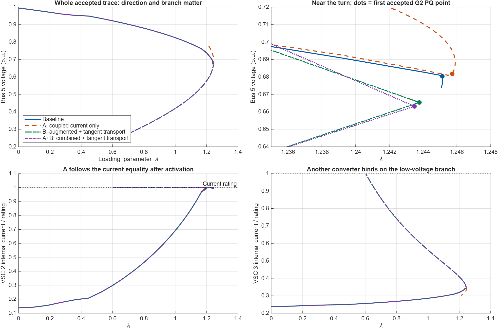
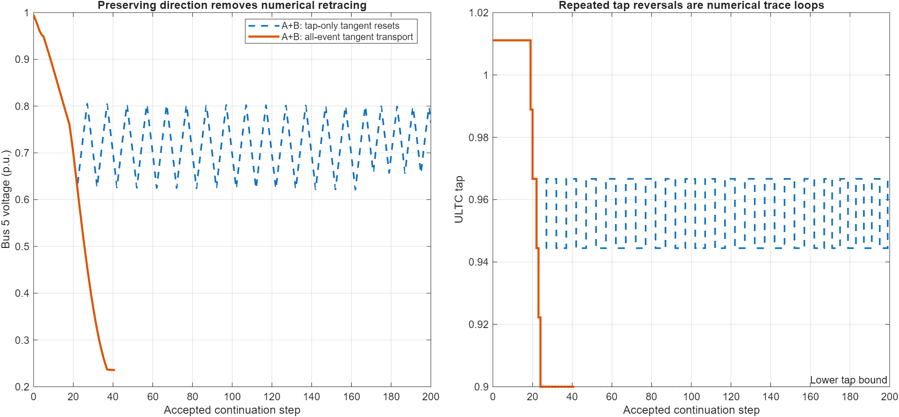
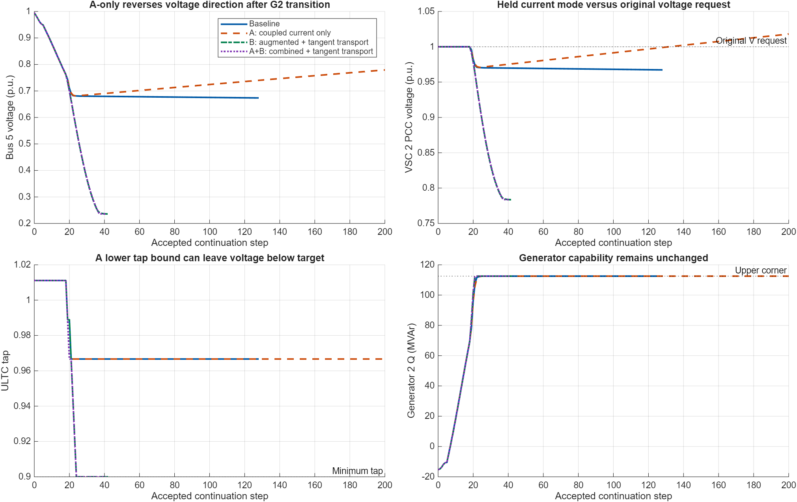

# CPF experiments: coupled converter limits and continuation through transitions

Two subagents developed the two requested experiments in parallel. The 150 MW generator-2, constant-P/Q, non-slack-dispatch Beerten study with ULTC and switched shunt was used throughout. MATLAB MCP executions were coordinated in one shared session. **Production code, case parameters and historical outputs are unchanged.**

The experiments support pursuing both ideas together. A physical current equality solves VSC 2's moving-boundary problem; augmented correction and consistent tangent direction allow continuation beyond the old failure. They do not yet deliver a complete FULL trace. The next unresolved problem is converter 3's radial P/Q projection at very low voltage.

## Direct comparison

The primary step is 0.10; 0.05 repeats the same experiment with a smaller predictor step. The table uses the final all-control tangent revision for B and A+B. Initial variants are retained and discussed below. Maximum lambda means **largest accepted sample**, not a localized physical nose. Final lambda is on the descending branch where applicable; a smaller final lambda means tracing farther down that branch, not a reduction of maximum supported demand.

| Variant | Step | Accepted points | Maximum sampled lambda | Final lambda | Final V5 | Stop |
|---|---:|---:|---:|---:|---:|---|
| Baseline | 0.10 | 129 | 1.245160631 | 1.245061005 | 0.673537 | vsc_capability_limit |
| A: coupled current | 0.10 | 201 | 1.245901556 | 1.212555974 | 0.779200 | step_limit |
| B: continuation + all-control direction | 0.10 | 43 | 1.243784920 | 0.603064705 | 0.235722 | vsc_capability_limit |
| A+B: combined + all-control direction | 0.10 | 42 | 1.243489358 | 0.603079754 | 0.235716 | vsc_capability_limit |
| Baseline | 0.05 | 45 | 1.245254301 | 1.245254301 | 0.680698 | gen_capability_limit |
| A: coupled current | 0.05 | 201 | 1.245901455 | 1.220082859 | 0.768523 | step_limit |
| B: continuation + all-control direction | 0.05 | 77 | 1.244125681 | 0.603048242 | 0.235709 | vsc_capability_limit |
| A+B: combined + all-control direction | 0.05 | 79 | 1.243902456 | 0.603058661 | 0.235707 | vsc_capability_limit |

Every row reports configured-stop success, but **none completed FULL**, whose endpoint is the descending return to lambda zero. A's stop is the unchanged 200-step budget. B and A+B stop during converter capability settlement. Their very low-voltage branch is an algebraic continuation result, not a demonstration of dynamic stability or acceptable operation.

Lines connect accepted samples in their recorded order; connecting segments across control changes are not event-localized solution samples. Dots identify the first accepted G2 PQ state. Closely overlapping B and A+B curves do not mean their converter equations are identical: B repeatedly fixes a projected Q, whereas A+B follows the physical current equality continuously after activation.

## A — solve the current limit with the network

The experimental PF replaces the released converter AC-Q equation with the normalized squared-current equality. The current comes from the actual full-station electrical solution, so voltage, internal power, losses and Q change together during Newton correction. The same equation and analytic Jacobian participate in PF, ordinary CPF correction, tangent construction and control handoffs. VSC 2 retains its DC-voltage equation and bridge balance; its active power remains the balancing outcome.

For isolation, A keeps the original fixed-lambda settlement after a limit change. It removes the extra 0.1% Q clipping for the active current mode, because there is no longer a fixed Q order to clip. Equipment ratings are unchanged. Activation supports a pure current limit under the existing active-power-preserving policy; the prototype rejects an unsupported second voltage/dispatch limit and does not yet implement recovery to the original AC control request.

**Measured effect:** both runs pass the previous converter correction failure and reach 201 accepted points. The new analytic current-row derivative agrees with independent central differences to relative infinity errors between 7.1e-12 and 8.1e-10 at the tested point. All accepted points pass the independent physical audits.

**Why that is insufficient:** A retains the old tangent reset after generator PV-to-PQ switching. Bus-5 voltage starts increasing again. Later, VSC 2's PCC voltage rises above its original 1-p.u. request while the prototype still forces maximum current. That path requires a recovery test before it can represent the original control policy. Passing equipment inequalities alone does not validate it. The 200-step budget was therefore not increased to make this path run longer.

Exact implementation: `coupled_limit/exa_pf.m:879` replaces the residual row and `:1057` supplies its analytic derivative; `coupled_limit/exa_cpf.m` carries activation metadata in cases, context-cache keys and active-set signatures. [A's detailed report](coupled_limit/summary.md), [equation design](coupled_limit/design.md) and [complete diff](coupled_limit/experiment.diff) preserve the full scope.

## B — retain continuation during capability settlement

B replaces the converter and generator fixed-lambda re-solves with an augmented correction. It solves lambda together with the electrical state on a transverse plane through the pre-switch candidate, using the incoming continuation tangent. When PV-to-PQ changes the number of variables, it maps the tangent by variable identity. The outgoing tangent is oriented consistently with the incoming direction.

The original converter Q/P projection and 0.1% inward margin remain. Tap and shunt electrical settlement remain at the event loading; their numerical direction is transported afterward. This isolates continuation improvements from the new current-boundary equation.

**Measured effect:** B passes the troublesome generator transition and traces down to about lambda 0.60305–0.60306, with bus-5 voltage about 0.23571–0.23572 p.u. It then fails while settling a newly binding converter-3 current limit. The all-control tangent extension changes B's trajectory only at numerical roundoff because its descending tap changes already coincided with a converter correction that supplied the transported tangent.

**Remaining limitation near the nose:** the prototype does not precisely locate the first generator capability crossing. For example, the original B 0.10 run's pre-switch candidate at lambda 1.251231555 is corrected to 1.244072451 after G2's transition, then to 1.243784920 after converter settlement. This spans part of the transition region. Its smaller maximum accepted sample is not evidence of a smaller physical loadability limit. Event localization is needed before comparing noses quantitatively.

Baseline fixed-lambda converter correction is at `matpower/lib/runcpf_vsc_mtdc.m:1332`; B's augmented transition helper is at `continuation_limit/b17_cpf.m:3614`, state mapping at `:3608`, and outgoing tangent transport at `:831`. [B's detailed report](continuation_limit/summary.md), [initial diff](continuation_limit/implementation.diff), and [all-control extension](continuation_limit/all_controls/README.md) document the changes.

## What combining the ideas exposed

The first combined trial transported direction during generator/converter transitions, but retained the old reset for a tap-only change. This produced repeated numerical retracing: after a downward tap move, the tangent was reset toward increasing lambda; the trace returned to higher voltage, reversed the tap, and repeated. These are loops in a steady-state numerical trace, not simulated physical oscillations.

The bounded follow-up seeds the tangent transport from the last accepted tangent at every predictor trial, so a tap-only change also keeps a consistent orientation. Existing mapping handles any state-dimension change. No tap bounds, deadbands, solver tolerances or step budget were altered.

**Result:** the loops disappear. The combined runs trace down to lambda 0.603079754 and 0.603058661 at steps 0.10 and 0.05. VSC 2 stays exactly on its current boundary, and its PCC voltage stays below its original voltage request while that mode is active; A-only's observed recovery issue does not arise on these accepted combined traces. Converter 3 then reaches its current limit, and the remaining outer P/Q projection fails to settle.

The initial combined run and its failure are preserved in `coupled_limit/combined/`. The corrected direction experiment is in `coupled_limit/combined_all_controls/`; its [summary](coupled_limit/combined_all_controls/summary.md) and [incremental diff](coupled_limit/combined_all_controls/all_controls.diff) distinguish the two. This test shows why implementing the two proposals as unrelated local fixes is insufficient: direction must survive every relevant control transition.

## The next failure is converter 3

Converter 3 initially holds PCC P=35 MW and Q=5 MVAr at bus 5. In this filter-free station, its 150-MVA current base gives a fixed-order voltage threshold of **sqrt(35²+5²)/150 = 0.2357022604 p.u.** The final accepted voltages are just above that threshold. This is a boundary of those particular fixed orders.

The actual configured saturation policy for converter 3 is **radial**, preserving its PCC power factor while reducing both P and Q. MATLAB resolved this from the saved case/options; see [C3_policy.json](C3_policy.json) and `matpower/lib/vsc_capability_policy.m:45`. The new coupled-current mode currently handles active-power-preserving control, so converter 3 still uses the older outer projection.

The logging-only replay of B shows the feedback clearly:

| Trial stage | Lambda | V5 (p.u.) | C3 P / Q (MW / MVAr) | C3 capability margin (MVA) |
|---|---:|---:|---:|---:|
| First violated candidate | 0.603006419 | 0.235699356 | 35 / 5 | -0.0004357 |
| After first projection and augmented solve | 0.592959107 | 0.231831601 | 34.964569 / 4.994938 | -0.544808 |
| After another projection and augmented solve | 0.461259631 | 0.183401309 | 34.390811 / 4.912973 | -7.229769 |
| Next Newton attempt, rejected | -0.917067347 | Outside valid model domain | Not accepted | Residual about 1.4142e6 |

The power reduction lowers voltage enough that the current violation grows instead of disappearing. VSC 2 also becomes violated in B. In the combined case VSC 2's current is enforced directly, but converter 3's outer projection still fails. The last converged intermediate corrections are not accepted CPF points when the full capability settlement fails. Smaller steps reproduce the same type of breakdown.

The tap has reached 0.9 and the shunt B=15 at 1 p.u.; both are physically saturated. At V5≈0.2357, that shunt supplies only about 0.833 MVAr. Bus 7 remains below its requested voltage band. The study's declared saturation policy permits this exhausted state; it does not mean voltage regulation succeeded. A strict in-band check remains false and is retained as such in the audit; acceptance additionally checks the physical bound and declared policy.

**This stopping point is not certified physical infeasibility.** Because radial derating is allowed, the fixed-order voltage threshold alone does not rule out a subsequent feasible branch. Nor does Newton failure establish that no branch exists.

## What the experiments justify next

1. Retain the coupled physical current equation and its analytic derivative as a promising component; preserve DC-voltage control and bridge balance explicitly.
2. Carry continuation direction through generator, converter and discrete-control changes. The tap-loop experiment provides direct evidence for including all those stages.
3. Locate capability crossings before changing equations. Until then, sampled maxima across variants should not be called a measured gain or loss of stability margin.
4. Extend simultaneous boundary equations to the declared radial policy for converter 3. A possible formulation solves the current equality together with a PCC P/Q-ratio equation, replacing the two fixed PCC power orders with the appropriate unknowns and retaining DC balance. This is a proposed follow-up, not implemented here; equation count, limit intersections and feasible direction still require validation.
5. Add an explicit recovery test before general use. The A-only trajectory shows why equipment feasibility alone cannot justify holding a saturated controller indefinitely.

These experiments support the numerical direction, but do not justify merging either prototype into production yet. The useful result is both progress beyond the original failure and a more specific next target: coupled radial-limit control, correctly located events, and consistent control recovery.

## Reproducibility and verification

The saved baseline was reused, not overwritten. Ten new full-CPF attempts cover A, B, initial A+B, all-control A+B, and all-control B at the two step sizes; one additional B replay adds logging only and exactly reproduces every accepted lambda, bus, generator, converter and branch array. FULL remains incomplete in every attempt. Raw success scopes, warnings, rejected-trial journals and MAT files are preserved in each experiment directory.

All ten runs used cases identical to the saved baseline. Their options are identical except for the declared 0.05 step sensitivity: [input identity checks](input_identity.json). All 295 snapshotted production/study files retain their original SHA-256 values: [integrity check](production_integrity.json). A's first development attempt encountered a scalar-assignment implementation error, fixed before the successful saved runs; [execution notes](coupled_limit/execution_notes.md) retain it. No MCP connectivity failure or CLI fallback occurred.

The parent's independent audit recomputes AC/DC and bridge balances, station phasors/current, losses, fixed unsaturated converter schedules, DC voltage, converter current/upper-voltage and generator capability, tap/shunt grids/bounds, declared control saturation, and lambda-dependent load interpolation. The reported A, B and combined traces pass these 17 checks. This audit does not validate missing recovery logic, event localization, lower internal-voltage limits not enabled by the study, dynamic stability or global loadability.

Audit files: [A step 0.10](A_100_audit.json), [B step 0.10](B2_100_audit.json), [combined step 0.10](AB2_100_audit.json), [A step 0.05](A_050_audit.json), [B step 0.05](B2_050_audit.json), [combined step 0.05](AB2_050_audit.json). The corresponding CSV traces and all source copies are in this output directory.

The three MATLAB plots were visually inspected and embedded in the standalone HTML. HTML image/link structure was checked offline. Full browser rendering was not verified; the existing browser security restriction on local-file preview was respected. The unchanged raw nose flag remains false in FULL. Tangent extraction for diagnostics uses the last finite component per stored column, because a PV-to-PQ state-size change pads earlier columns with NaNs.
