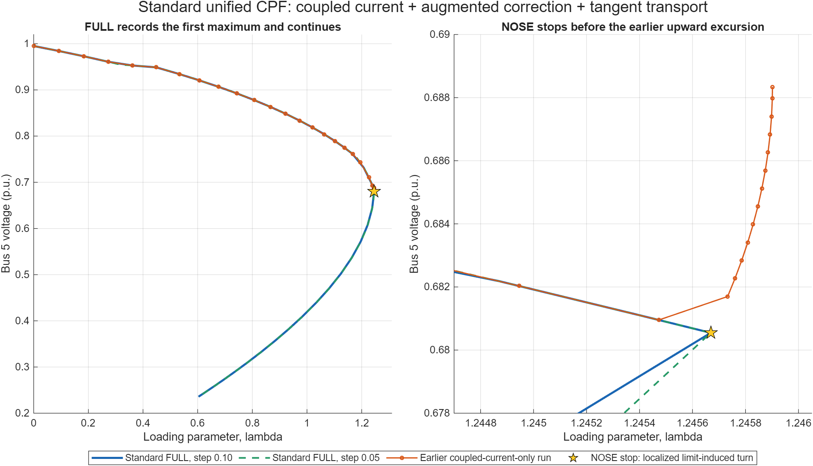

# Standard unified CPF integration — 2026-09-17

**Implemented in the production unified VSC-MTDC CPF:** coupled converter-current constraints, augmented capability-transition correction, tangent transport across all control changes, and detection/refinement of control-limit loading turns. NOSE now stops at the first localized loading maximum; FULL records the turn and continues.

Case parameters and ratings are unchanged. Historical experiments remain intact. The complete algorithm contract and scope are in [CPF_LIMIT_CONTINUATION.md](../../docs/CPF_LIMIT_CONTINUATION.md).

The lines connect accepted continuation points; the descending segments immediately after the event have different sample spacing. The star is the localized first maximum. The orange upward excursion belongs to the earlier coupled-current-only implementation and is absent from the new forward trace. [Vector PDF](standard_pv.pdf).

## Studied case: actual results

The inputs are the previously saved constant-P/Q, non-slack generator-dispatch study with ULTC, switched shunt and G2's 150 MW capability. Original options and numerical budgets are preserved, with NOSE/FULL and the two initial steps explicitly selected.

| Stop mode | Initial step | Final lambda | Final V5, p.u. | Termination | Requested endpoint reached |
|---|---:|---:|---:|---|---|
| NOSE | 0.10 | 1.245668942302 | 0.680546987456 | LIMIT_INDUCED_TURN | Yes |
| NOSE | 0.05 | 1.245668943179 | 0.680547002170 | LIMIT_INDUCED_TURN | Yes |
| FULL | 0.10 | 0.603073795247 | 0.235713351982 | VSC capability limit | No |
| FULL | 0.05 | 0.603048625819 | 0.235703575148 | VSC capability limit | No |

The two NOSE event locations differ by less than 9e-10 in lambda. They agree within 1.3e-9 with the earlier independent augmented G2-limit solve, lambda=1.245668943510. NOSE and FULL locate exactly the same first event for each step size.

At the event, G2 is at P=150 MW and Q=112.5 MVAr. The incoming loading tangent is positive and the consistently oriented outgoing tangent is negative. The solver records a **limit-induced turn**, not a smooth tangent-zero nose. This is a static equilibrium-path result, not a dynamic stability certificate.

FULL subsequently reaches the same low-voltage converter-capability region seen in the combined experiment. Its legacy `success=true` reflects the configured stop policy; `requested_endpoint_reached=false` explicitly records that FULL did not finish. No MATLAB numerical warnings were captured in these four verification runs. All 17 independent physical checks pass in each run.

## Production changes

- [runcpf_vsc_mtdc.m](../../matpower/lib/runcpf_vsc_mtdc.m): exact current activation for the preserve-P/current-limited policy; augmented VSC/generator capability correction; tangent transport across capability and tap/shunt changes; transactional rollback, event refinement and event/termination reporting. Key regions: lines 400–410 (event resolution), 840–930 (orientation, rollback and control-turn localization), 1560–1625 (current activation), 3730–3770 (transition correction), and 3880–3970 (smooth-nose location).
- [runpf_vsc_mtdc_unified.m](../../matpower/lib/runpf_vsc_mtdc_unified.m): validated active-current metadata (line 648), actual internal-current residual (line 899), and analytic Jacobian row (line 1077).
- [runpf_vsc_mtdc.m](../../matpower/lib/runpf_vsc_mtdc.m): rejects an active current constraint with the unsupported sequential method, line 104.
- [savecase.m](../../matpower/lib/savecase.m): preserves active-current metadata, line 583.
- [t_cpf_coupled_controls.m](../../tests/t_cpf_coupled_controls.m): new derivative, metadata, event and physical-trace regression checks.
- [t_vsc_mtdc.m](../../matpower/lib/t/t_vsc_mtdc.m): updates one outdated FULL-stop expectation to require actual descending-lambda-zero completion and a recorded turn.

The converter equality uses internal power and internal voltage consistently:

\[
\frac{P_c^2+Q_c^2}{(S_{\rm base}|U_c|I_{\max})^2}-1=0.
\]

The full station/network model still relates these quantities to the PCC. DC-voltage regulation and bridge balance remain in the equations. The released PCC-Q order is retained as data but is not an enforced Q equality while current-limited.

## Nose-skip handling

The solver checks the outgoing loading tangent and its orientation relative to the incoming tangent before accepting a trial. A suspected control turn or direction reversal restores the complete pre-trial control/case/policy/cache/event state and halves the continuation step. Refinement can proceed below the ordinary minimum continuation step.

Acceptance of a continuous control-limit turn requires a sufficiently short arclength step, converged network equations, positive tangent alignment, the correct one-sided loading signs, and small incoming/outgoing state intervals. The normal step-size target is restored when FULL continues. The studied step-0.1 event needed 20 rejected refinements; all recorded rollbacks passed their restoration assertion.

Smooth noses still use the existing tangent-zero/bracket locator, now with an explicit localization-success check. FULL records smooth noses too. Unresolved localization returns failure and keeps the last accepted point instead of declaring NOSE success.

This is numerical localization by continuation-step refinement. It does not guarantee detection of multiple hidden folds inside one large step, nor does it implement a global search over equilibrium branches.

## Verification

**766/766 checks passed on the integrated code:**

| Suite | Passed | Evidence |
|---|---:|---|
| Existing VSC-MTDC suite | 330/330 | [Final test log](t_vsc_mtdc_final.txt) |
| PCC and full-station regression | 141/141 | [Results](final_pcc_regression/station_regression.json) |
| Directional-loss regression | 242/242 | [Results](final_loss_regression/directional_regression.json) |
| New coupled-control checks | 53/53 | [Results](coupled_regression/coupled_controls.json) |

The three new finite-difference checks cover the original station, a resistive/filter station and a station with phase shift plus charging. Relative current-row Jacobian errors are 3.39e-11, 2.16e-11 and 1.48e-11. Metadata tests reject invalid sizes, negative/nonfinite limits and incompatible control modes; save/load preserves the active constraint.

The existing paper-control FULL fixture now completes its requested descending lambda=0 endpoint under its explicit freeze recovery policy. Its old assertion expected a VSC-limit stop and initially failed (329/330). Before changing that expectation, a separate replay verified endpoint completion, AC/DC/bridge balance below 1e-6 MVA/MW and no converter-capability violation. The final suite then passed 330/330. This fixture is different from the studied ULTC/shunt/G2-150-MW case above.

All execution used MATLAB MCP following the project guide. An initial integration smoke run exposed an empty auto-rated Smax metadata value in a scalar ceiling check; that check was corrected to use the resolved rating already stored in the active-current state. The failed smoke run was not counted as a passing solver result. No MATLAB execution fallback or case/tolerance changes were used to obtain passing regressions.

Static analysis found no parse errors. Remaining messages are unused-variable/helper and dynamic-log-growth advisories; [analyzer output](code_analysis.json). The exported PNG was visually inspected.

## Scope and remaining limits

- Coupled current is the standard treatment for the existing preserve-active-power/current-boundary policy. Radial and internal-voltage projection policies retain their existing treatment.
- Current constraints remain latched during continuation. Automatic return to AC-voltage control and a general complementarity formulation for simultaneous limits remain separate work.
- NOSE success now includes a localized limit-induced first maximum. Callers needing only smooth saddle-node events can inspect `smooth_nose_detected` separately.
- FULL does not imply that every case will reach its descending endpoint. The studied case still stops later at a converter-capability boundary, reported explicitly above.

## Artifacts and preservation

[Final run directory](final/) contains all four MAT snapshots, trace CSVs, numerical summaries and independent audits. [Source manifest](source_changes.json) and `diffs/` record exact changes against `before/` snapshots. No study file changed relative to the pre-experiment manifest. Existing historical outputs were read and preserved.

[verify_standard.m](verify_standard.m) reproduces a run into a new subdirectory; it refuses to overwrite an existing MAT result. [plot_standard.m](plot_standard.m) renders the accepted trajectories. The initial integration script is retained as development provenance, not as a replacement for the final source diffs.
