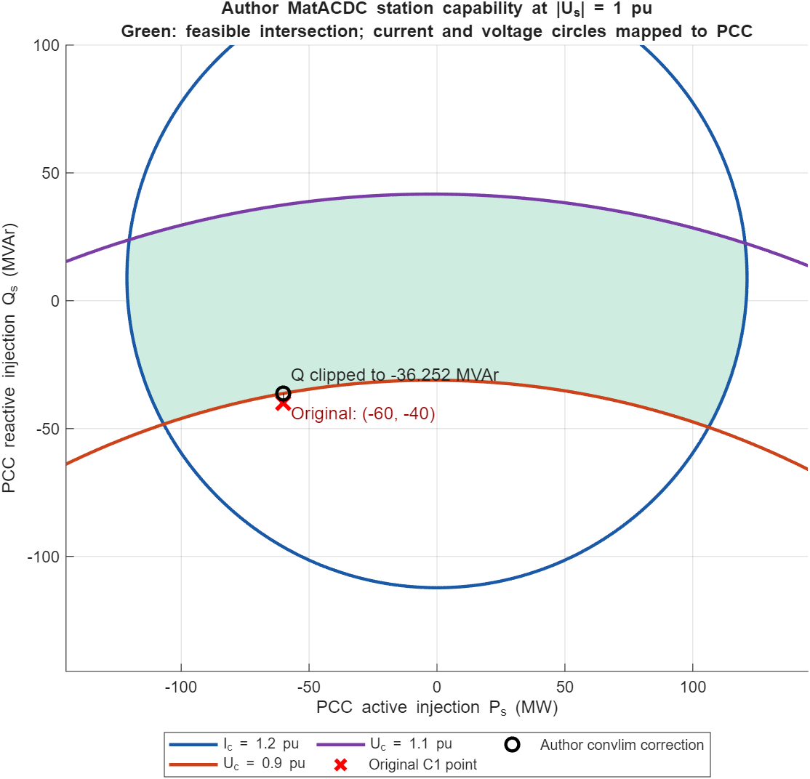

# Capability definition and enforcement in archived MatACDC 1.0

Read-only source inspection and isolated converter calculation, 2026-09-16. Production code, cases and historical results were not changed.

## Definition: physical internal limits expressed at the PCC

The coordinates are grid/PCC injection Ps and Qs. Positive values mean injection into the AC grid. The constraints are converter current magnitude Ic ≤ Icmax and internal AC voltage Ucmin ≤ |Uc| ≤ Ucmax. The author case specifies 1.2 pu, 0.9 pu and 1.1 pu respectively. The per-unit power base is 100 MVA; multiply plotted pu P/Q by 100 to obtain MW/MVAr. Limits are explicit case inputs, not computed from a single apparent-power rating.

At each grid voltage, the transformer/filter/reactor equations map these internal constraints into PCC coordinates. Thus using PCC voltage in the mapping is correct: MatACDC is not substituting PCC voltage for internal voltage in an internal-power current calculation.

For the station without taps or branch charging, let Zt be transformer impedance, Zr reactor impedance and Yf=jBf the filter admittance. Rotate the PCC phasor to real V=|Us|; let S=Ps+jQs in pu. Then

\[
I_s=S^*/V,\quad U_f=V+Z_tI_s,\quad I_c=I_s+Y_fU_f,\quad U_c=U_f+Z_rI_c.
\]

Define A=1+YfZt, B=Yf, D=1+ZrYf and E=Zt+ZrA. These give Ic=A S*/V+B V and Uc=E S*/V+D V. For nonzero A and E, define

\[
M_I=-V^2(B/A)^*,\qquad R_I=VI_{\max}/|A|,
\]

\[
M_U=-V^2(D/E)^*,\qquad R_{U,\min}=VU_{\min}/|E|,\quad R_{U,\max}=VU_{\max}/|E|.
\]

The physical feasible set is

\[
|S-M_I|\le R_I,\qquad R_{U,\min}\le |S-M_U|\le R_{U,\max}.
\]

It lies inside the current disk and maximum-voltage disk, and outside the minimum-voltage disk. Resistance can shift the centers in active as well as reactive power. With no filter, the current circle is centered at the origin and has radius V·Imax. The voltage limits still depend on total series impedance. As PCC voltage changes, the circle centers and radii change; the curve is not immutable.

This affine derivation is algebraically equivalent to the pi-equivalent used by the archive. In `convlim.m`, lines 92–108 define pi-equivalent admittances Y1,Y2; lines 112–126 form the current circle and voltage circles. The voltage center is −V²·conj(Y1+Y2), and the voltage radii are V·[Ucmin,Ucmax]·|Y2|. Lines 92–103 explicitly branch for missing transformer and/or filter. The routine selects the usual upper operating arcs of the voltage circles (lines 238–248); it is not a general global optimization over arbitrary angle branches or degenerate impedances.

## Enforcement: active-power priority, followed by another power-flow iteration

`convlim.m` first finds the minimum/maximum feasible P and the intersections of the current/voltage circles. At a feasible prescribed P, it keeps P and adjusts Q to the relevant current/voltage boundary (lines 230–270, violation code 1). If P itself is outside the feasible range, it moves both P and Q to the corresponding feasible P extremum (lines 275–287, violation code 2). This implements preservation of active transfer when possible, sacrificing reactive output/absorption or AC voltage regulation first.

The caller `runacdcpf.m`, lines 443–551, computes candidate corrections, selects one converter per DC grid per pass, gives P violations selection priority, and otherwise selects the largest Q correction. It updates the PCC setpoints and recomputes station currents, voltages, powers and losses. If the selected converter controlled PCC voltage, that control is removed and it becomes PQ (lines 504–524). If it had droop control, droop is removed (lines 527–531). The outer AC/DC iteration then continues. This is a sequential control-limit procedure, not an optimal redispatch.

The permitted correction tolerance is `TOLLIM`; differences below it suppress the violation flag (`convlim.m` lines 294–297). This is distinct from exact geometric membership.

## DC-voltage converter exception and default options

The archived program explicitly removes DC slack converters from the adjustment loop (`runacdcpf.m` lines 451–456). It checks all converters afterward and prints a warning for a DC slack converter outside its limits, without automatically clipping it, transferring its balancing duty or invalidating the convergence flag (lines 627–641).

The default `macdcoption` sets `LIMAC=0`, so capability enforcement is off. It must be explicitly set to 1. The separate `LIMDC` option is marked unimplemented. The AC capability check therefore does not enforce every DC line rating or DC-voltage operating bound.

## Actual C1 example

The isolated author routine was run at fixed PCC voltage 1.0 pu with the exact author station data. It returned:

| Quantity | Initial | Corrected |
|---|---:|---:|
| PCC P | −60 MW | −60 MW |
| PCC Q | −40 MVAr | −36.251602 MVAr |
| Converter current | 0.766693 pu | 0.743786 pu |
| Internal voltage | 0.889865 pu | 0.900000 pu |

This is a lower-internal-voltage violation, not an overcurrent violation. Reducing reactive absorption raises the internal voltage to its lower bound while preserving active transfer. The result is one `convlim` projection at fixed PCC voltage, not a complete limit-enforced network PF solution.

## Relation to our implementation

Our current station capability map uses the same full-station physics for current and upper voltage. It additionally supports filter conductance, branch charging and phase shift. The important missing boundary is the lower internal voltage; our retained separate PCC active-power ceiling is also an extra constraint. Control policies and DC slack handling must be compared separately from the geometry. Those differences do not affect the previously compared unconstrained base solution, but can affect a limit-enforced run.

Primary sources: [archived convlim.m](../beerten_validation_batch6_20260911/reference/MatACDC1.0/convlim.m), [runacdcpf.m](../beerten_validation_batch6_20260911/reference/MatACDC1.0/runacdcpf.m), [macdcoption.m](../beerten_validation_batch6_20260911/reference/MatACDC1.0/macdcoption.m), and [Beerten et al. 2012, Section II-B](https://lirias.kuleuven.be/retrieve/246525).

Reproduction: [illustrate_capability.m](illustrate_capability.m), [evidence.json](evidence.json). The author routine is copied under a distinct function name solely to avoid collisions between its legacy index functions and project functions. Its numerical body is unchanged. Assertions verify preserved P, the corrected Uc=0.9 boundary and compliance with Icmax. The plot was visually inspected.
