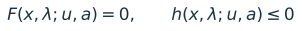
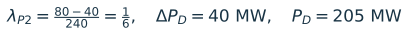
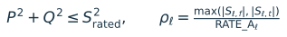
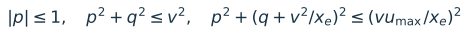
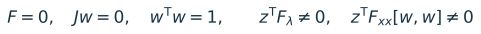
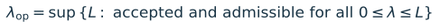

# Operational limits and voltage loadability

Illustrated study explanation and proposed methodology, 2026-09-14. Open report.html or the PDF for rendered figures and equations.

## 1. Operational limits and voltage loadability

*BEERTEN PROJECT  /  14 SEPTEMBER 2026*

Report two different endpoints: the first restriction on admissible operation, and the endpoint of a clearly specified equilibrium continuation. A solver success flag, a saturated controller and a voltage-stability boundary answer different questions. None is a substitute for the other two.

LaTeX source: `F(x,\lambda;u,a)=0,\qquad h(x,\lambda;u,a)\leq 0`

Here x contains electrical states; u contains tap and shunt states; a identifies active control/capability modes. The equalities F describe the chosen network and control model. The inequalities h describe declared operating and equipment criteria. Electrical convergence establishes a solution of F to tolerance; it does not establish every inequality.

### The decisive result for the new dispatch

LaTeX source: `\lambda_{P2}=\frac{80-40}{240}=\frac{1}{6},\quad \Delta P_D=40\ \mathrm{MW},\quad P_D=205\ \mathrm{MW}`

The retained generic thermal curve for generator 2 has an 80 MW ceiling, even though its original MATPOWER PMAX field is 300 MW. With PG2 = 40 + 240λ, no point above λ = 1/6 can satisfy both that schedule and the selected capability model. This is a dispatch/capability restriction, not proof of voltage collapse. Another restriction could occur earlier. [L5-L9]

A new bounded MCP diagnostic confirms an implementation gap. At λ = 0.20 the unchanged solver returns PG2 = 80 MW rather than 88 MW while declaring target success. Its generator capability projection changes the generation direction. The report rejects those altered-dispatch samples as evidence for the user scenario; it does not adopt that behavior as policy. [N1]

### Scope and reading guide

Pages 2-6 explain the physical distinctions using diagrams and equations. Pages 7-9 separate new measurements from historical batch-6 evidence. Pages 10-12 propose event acceptance, endpoint reporting and a compact protocol. Pages 13-14 cover the AC versus HVDC comparison and bounded implementation work. Pages 15-17 record recommendations, evidence, references and reproducibility.

Preserved decisions: generic MBASE curves; slack MBASE = 1000 MVA with the existing generic exemption; generator 2 supplies scheduled growth; PQBRAK off; physical tap/shunt saturation enabled; no silent clipping or reassignment of scheduled generation. No production code, cases or control policies were changed.

Figure provenance: ILLUSTRATIVE means a teaching schematic with no inferred project margin. CODE-DERIVED means a formula or topology read from the case/code. MEASURED means saved MATLAB results or historical batch-6 output. All equations and plots are rendered locally; no generated image is used as numerical evidence.

## 2. The network and its declared direction

*CASE EVIDENCE  /  NOT THE UNMODIFIED PUBLISHED BENCHMARK*

![Figure 1. Connectivity and stored ratings are case-derived; positions and routing are schematic. Only circles are buses; line crossings are not junctions. All nine original AC branches have RATE_A = 250 MVA. Converter stations each have 150 MVA transformer/reactor ratings. [L1, L5, N1]](figures/01_network.png)

LaTeX source: `P_D=165+240\lambda,\quad Q_D=40+40\lambda,\quad P_{G2}=40+240\lambda`

LaTeX source: `P_{G1}=P_D+P_{\mathrm{loss,all}}-P_{G2}=125+P_{\mathrm{loss,all}}`

Demand grows only at bus 5. Other demand is 105 MW and 30 MVAr: bus 2 = 20/10, bus 3 = 45/15, bus 7 = 40/5. Generator 2 is physically at original bus 6. The slack at bus 1 covers 125 MW of net base demand plus total AC, converter and DC losses. Its incremental duty is only the change in those losses if the declared schedule is preserved.

MBASE is in MVA. In this project it is the fallback base used to scale the chosen generic generator curve; changing slack MBASE does not change its PMAX = 500 MW, its original Q box, or its exemption from generic enforcement. The exemption is a declared model boundary, not a claim of unlimited physical generation. Audit original slack P/Q boxes separately. [L5, L8, L9]

The seven-bus controlled extension, its DC impedances, internal converter setpoint semantics and added tap/shunt controls differ from the author MatACDC example. Batch 6 aligned the archived five-bus MatACDC 1.0 example, not every case called Beerten. Use the local scenario name and input hashes in comparisons. [L1, R4]

## 3. Deadband is a regulation objective

*CONCEPTS  /  STORED VOLTAGE VALUES*

![Figure 2. The shaded interval values come from this case. The three voltage points are illustrative. The controller band applies at its monitored bus; the bus range is checked for every relevant bus. [L1-L3]](figures/02_bands.png)

The controller band [0.95, 1.03] pu tells eligible tap/shunt controls when to request a move. The bus range [0.90, 1.10] pu is a separate stored operating criterion. Neither should be relabeled as the other. The case range is a starting criterion for this study, not a claim that it is the required utility planning standard.

Numerical activation tolerances are also distinct: the effective transformer tolerance is 0.005 pu and the switched-shunt tolerance is 1e-5 pu in the batch-6 preparation. Retain these values and evaluate the actual prepared control rule. Do not replace the band with the tolerance, or apply one controller family’s tolerance to another. [L1, L3]

### Worked example: solved, saturated and operationally acceptable

Suppose bus 5 is at 0.92 pu and the shunt has reached its maximum 15 MVAr-at-1-pu state. A fresh full-model control pass asks for more capacitive support, but no legal step exists. Under saturate, the controller can be settled and accepted with regulation_satisfied = false. The bus still passes the illustrative use of the stored 0.90 minimum. At 0.88 pu it would fail the bus operating criterion as well.

LaTeX source: `Q_{\mathrm{sh}}=B_{\mathrm{sh},1pu}|V|^2,\qquad Q_{\mathrm{sh}}(0.92)=15(0.92)^2=12.696\ \mathrm{MVAr}`

Physical saturation leaves the device in service at its bound. It does not lock it forever. A later legal opposite request can move it away; simply re-entering the band does not itself command a reverse step. Explicit locks/disabled devices remain separate statuses. An unresolved legal move, cycle, unsupported mode or failed correction is not physical saturation. [L3]

## 4. Operating boundaries and equilibrium boundaries

*ILLUSTRATIVE PV CURVES  /  NOT NEW BEERTEN RESULTS*

A voltage or branch loading threshold normally adds a reporting/acceptance test, without changing the power-flow equations. A protection trip or remedial action would change topology or controls, but it must be explicitly modeled and belong to a named scenario. A thermal rating crossing alone does not automatically open the branch in these calculations.

LaTeX source: `P^2+Q^2\leq S_{\mathrm{rated}}^2,\qquad \rho_\ell=\frac{\max(|S_{\ell,f}|,|S_{\ell,t}|)}{\mathrm{RATE\_A}_\ell}`

For each rated branch audit apparent power at both ends, since losses and charging make them different. RATE_A in this case is interpreted as a continuous MVA criterion. If a future study instead specifies conductor current/temperature, use its corresponding physical rating and ambient/time assumptions. A zero/missing rating is unknown or unspecified, not zero capacity and not evidence of compliance. [R3, L1]

A CPF fold is a turning point in loading along a particular equilibrium branch. A capability mode change can also remove the locally admissible continuation without a smooth pre-limit nose. Conversely, many PV→PQ or converter V→Q transitions leave a feasible branch and should be followed after full re-correction. First binding is not automatically collapse. [R1, R5, L1]

These are quasi-static loadability statements. A CPF trace does not certify transient stability, converter control dynamics, protection behavior or the basin of attraction of an equilibrium. The IEEE/CIGRE classification distinguishes such phenomena and their timescales; a high-voltage algebraic solution is not by itself a complete dynamic-stability certificate. [R5]

## 5. Generator saturation: retain the selected model

*CODE-DERIVED CAPABILITY  /  MEASURED G2 SAMPLES*

![Figure 4. Left: exact generic thermal boundary for G2 MBASE = 100 MVA, overlaid with the new bounded diagnostic samples. Right: two illustrative voltage cross-sections of the implemented VSC current surrogate. These are generic/model regions, not manufacturer curves; the right-hand point is illustrative. [L7-L10, N1]](figures/04_capabilities.png)

LaTeX source: `q_{\max}(p)=\sqrt{1.7^2-p^2}-0.9,\qquad 0\leq p\leq0.8`

With p = P/100 and q = Q/100, the generic thermal curve has P from 0 to 80 MW. Its upper arc runs from (0,80) to (80,60). The lower boundary is -45 MVAr up to P = 15 MW, then a line to (80,-20). Thus a constant 100 MVA circle is not the implemented generator model. At P = 40 MW the upper limit is about 75.2271 MVAr; at P = 80 MW it is 60 MVAr. [L7]

When Q capability binds, the voltage-regulating equation can be replaced by a Q constraint (PV→PQ). Voltage then becomes an outcome. A viable Q-limited solution may continue, but its allowable Q must be re-evaluated as scheduled P changes. Original P/Q boxes remain separate tests against immutable input data; projected QMAX/QMIN fields must not replace the original audit reference.

A P capability limit is different for this scenario: continuing the original schedule is impossible above 80 MW. The operating study must stop at that boundary, or earlier if another declared criterion binds. There is no authority here to clip PG2 and let the slack supply scheduled growth. Q-only switching must preserve the 240 MW-per-λ active schedule. [L5, L6, N1]

Tap/shunt saturation exhausts a control actuator, while capability saturation restricts a device’s P-Q region and may replace control equations. Both can be electrically feasible. Both require reporting. Only a demonstrated inability to continue an admissible equilibrium under the declared equations supports a mathematical endpoint claim.

## 6. Converter limits need terminal-aware auditing

*MODEL SCOPE  /  NO CAPABILITY-POLICY CHANGE*

LaTeX source: `|p|\leq1,\quad p^2+q^2\leq v^2,\quad p^2+(q+v^2/x_e)^2\leq(vu_{\max}/x_e)^2`

For the implemented geometry, p = Pinternal/Snom, q = Qinternal/Snom, v = Vpcc and xe is the magnitude of transformer-plus-reactor impedance converted to the converter MVA base. The three regions are the active-power ceiling, current surrogate and internal-voltage surrogate. Here Snom = 150 MVA and umax = 1.15 pu. The wrapper’s unit conversion matters. [L10]

For the illustrative (120 MW, 60 MVAr) point in Figure 4, apparent power is 134.164 MVA. It is below 150 MVA at Vpcc = 1, but above 150 × 0.85 = 127.5 MVA at Vpcc = 0.85. Converter Q support can shrink as voltage falls even when nominal MVA stays unchanged. The exact voltage-circle inequality must also be checked; Figure 4 shows only current cross-sections.

### PCC → transformer → filter node → reactor → converter bridge → DC

PCC power measures exchange with the AC network. Internal converter P/Q, filter-node voltage and reactor current refer to other ports. In this project PAC_SET/QAC_SET control internal converter powers; the Beerten paper’s controlled powers refer to the AC system bus (paper pp. 2-3, equations 1-6). Therefore identical numeric setpoints do not establish identical transfers. The archived author manual, p. 19, shows filter-sensitive current and upper/lower voltage boundaries and its active-power priority; those are not identical to every local projection policy. [L1, L10, R4]

LaTeX source: `I_{r,pu}=\left|\frac{\underline{U}_f-\underline{U}_c}{Z_r}\right|,\qquad |I_{r,pu}|=\frac{|S_{c,pu}|}{|U_c|}`

The reactor-current expression uses complex terminal voltages and a consistent per-unit base; the power expression refers to the same reactor terminal and assumes the modeled series-reactor relation. It cannot be replaced by hypot(Pinternal,Qinternal)/Vpcc without establishing equivalence. Also audit actual internal voltage and both ends of transformer/reactor MVA. [L1, L10]

The current implementation supports geometric projections and mode changes. An AC-voltage controller may become a Q controller while the station retains DC-voltage control. A change in active transfer or loss of the last DC-voltage reference is more consequential: verify declared transfer assumptions and DC balance/control solvability, and stop if they cannot be maintained. Do not add a new fallback control assignment implicitly.

The existing converter projection policy, including preserve-P versus radial behavior, is inherited unchanged. Preserve-P is not an absolute guarantee if no feasible Q interval remains. Log P/Q before/after and the surviving AC/DC modes. Missing Uc,min, modulation/manufacturer envelope and DC voltage/thermal-rating metadata remain unknown; they cannot be counted as passed constraints. [L1, L10]

Capability mode release back to voltage control is not automatically supplied or certified by the current projection logic. Declare that path dependence. This differs from reversible physical tap/shunt saturation; do not borrow its release semantics for generator or converter modes.

## 7. New scenario: what was actually measured

*MCP DIAGNOSTICS  /  14 SEPTEMBER 2026*

![Figure 5. Saved new-scenario measurements. Dashed red continuation after the projection uses altered dispatch and is invalid for the declared study. Green samples preserve PG2 = 40 + 240λ. Connecting lines are visual guides, not continuous limit verification. [N1]](figures/05_new_diagnostic.png)

| Quantity | Boundary-target run | Diagnostic to 0.20 |
| --- | --- | --- |
| Requested λ | 1/6 | 0.20 |
| Returned λ | 0.166666661623 | 0.200000000000 |
| PG2 solved / scheduled (MW) | 79.99999879 / 79.99999879 | 80 / 88 |
| PG1 solved (MW) | 135.36588142 | 144.0763 |
| Electrical max mismatch (pu) | 1.55e-12 | 2.09e-9 |
| Target reached / NOSE | true / false | true / false |
| Declared dispatch accepted | Yes at saved samples | No after projection |

The boundary run has four accepted samples. Their original-bus voltage extrema stay within [0.974171525, 1.06] pu; the largest original-branch terminal loading across them is 117.588666 MVA versus 250 MVA. Final tap/shunt regulation is reported in band. These limited checks do not certify continuous first restriction, unmeasured equipment criteria, or a nose. [N1]

## 8. Event location and historical evidence

*KEEP DISPATCH SCENARIOS SEPARATE*

![Figure 6. λ is a loading coordinate, not clock time. Top: new diagnostic event values. Bottom: selected historical batch-6 events. Distinct axes and labels prevent transferring the old margins to the new direction. [L1, N1]](figures/07_timelines.png)

The new diagnostic first accepts a generator projection at λ = 0.1827865761, from PG2 = 83.86877825 to 80 MW. Its reported lambda_event = 0.1787880959 is not the exact 1/6 ceiling; margin_event = -2.909143 MW remains outside the curve. The locator interpolates P/Q and targets 75% of the candidate’s negative projection margin. The generic helper returns zero projection distance throughout the interior. Those quantities are unsuitable as a signed positive reserve for exact zero-crossing localization. [L7, L11]

| Historical batch 6 only | λ | Total demand MW | Meaning |
| --- | --- | --- | --- |
| Supported / step 0.1 | 1.138532043940 | 438.247691 | Re-correction failure; no NOSE |
| Independent fixed-state fold | 1.138532854472 | 438.247885 | Surrogate model diagnostic |
| Unconstrained historical nose | 1.305375520422 | 478.290125 | Detected NOSE in old dispatch |

Batch 6 held PG2 at 40 MW and used slack MBASE = 100 MVA. Its independent fixed-state fold concerns the final tap/shunt state, binding generator Q and implemented converter circle. It does not validate an all-equipment installation margin. All full-equipment scenario acceptance checks remained failed; the report retains the separate published-angle precision failure. Historical regression success does not erase either limitation. [L1]

## 9. A converged point can violate operation

*HISTORICAL MEASUREMENT  /  CLASSIFICATION EXAMPLE*

![Figure 7. Read directly from final_04 JSON traces, with no new CPF solve. Total demand is plotted, not bus-5 demand. All data in this figure belong to historical batch 6. [L1, L12]](figures/06_historical_pv.png)

At the historical supported endpoint the accepted electrical state has V5 = 0.668476203 pu, below the stored 0.90 minimum; PG1 = 505.506338 MW, above original PMAX = 500 MW; and original branches 1-2 and 2-5 exceed 250 MVA. Nevertheless that accepted point solves its equations and satisfies the supported non-slack and converter surrogate checks. Its shunt is at 15 MVAr-at-1-pu with unmet regulation. This is the practical difference between convergence, control settlement and complete operating acceptance. [L1]

That run reports success = true with success_scope = configured_stop_policy, requested_endpoint_reached = false, nose_detected = false and stability_margin_validated = false. The terminal cause vsc_capability_limit wraps a later electrical re-correction failure. The final rejected candidate is separate from the converged last accepted state. [L1, L2]

Physical tap/shunt saturate makes later unsuccessful control settlement a failure; that does not redefine the separate capability stop compatibility flag. Keep raw flags and derive a normalized study classification. A consumer must not read success = true as an attained nose or equipment certificate.

For the historical unconstrained nose, 373.290125 MW is bus-5 demand; 478.290125 MW is total demand. Neither is a new-scenario transfer rating. Report both demand and corridor-port measurements to avoid this ambiguity. [L1]

## 10. Compact event and acceptance contract

*PROPOSAL  /  NO NEW ENFORCEMENT ENABLED*

O = operating-restriction study. M = separately labeled mathematical continuation with the same physical/control model. Crossing a reporting-only voltage or thermal criterion may continue in M; violating the fixed generation schedule or bypassing a device capability requires a separately declared model experiment. Every event is logged, including when continuation is allowed.

| Event | Equation / state effect | O / M action | Classification to report |
| --- | --- | --- | --- |
| Deadband crossed; legal move exists | Tap/B move changes admittance; full electrical re-solve and fresh pass required. | Both: settle before accepting. | control_move; regulation status; monitored bus and tolerance. |
| Tap/shunt physical bound; outward request | No further state move; electrical equations retain bounded device. | Both: accept only solved, settled saturation. Stop O only if a separate criterion fails. | physical_saturation; reserve zero; regulation may fail. |
| Generator Q capability / applicable Q box | Replace voltage regulation by Q constraint; preserve scheduled P slope; recheck controls. | Both: continue if corrected state and remaining criteria pass. | capability_mode_change; PV→PQ; Q reserve. |
| G2 active capability ceiling | Schedule and capability become incompatible for larger λ. | O: stop at boundary. M with same schedule: stop as dispatch-limited. | dispatch_capability_limit; not collapse. |
| VSC capability boundary | Projection can replace AC V/P/Q equations; verify surviving DC control. | Both: re-correct; continue only within declared transfer/control policy. | VSC_mode_change; exact/surrogate margins and ports. |
| Bus V outside accepted range | None unless a protection/remedial action is explicitly modeled. | O: stop at first crossing. M: report and continue with label. | operational_voltage_limit; bus, value, threshold. |
| AC/station branch thermal criterion | None without modeled protection. Audit both ends. | O: stop at first crossing. M: report and continue with label. | operational_thermal_limit; branch/end/rating. |
| Slack original P/Q box; other physical infeasibility | No implicit resource reassignment. | O: stop. M: stop if maintaining physical model; any bypass is separate. | resource_limit / physical_infeasibility. |
| Missing DC or manufacturer limits | No justified equation or numerical threshold available. | Keep status unknown; no complete equipment certification. | not_assessed; missing field/data source. |
| Cycle, unresolved/unsupported control, failed correction | No accepted new state; preserve last accepted state and failed candidate. | Both: bounded diagnosis; stop unresolved run if unsuccessful. | control_failure or numerical_failure; no collapse claim. |
| Verified fold / limit-induced endpoint | Branch endpoint, or admissible branch lost after a mode change. | M: stop at NOSE or localized endpoint; FULL only if requested. | nose_detected / fold_supported / LIB_supported, with scope. |
| Target, point budget or minimum step | No physical event implied. | Target reached: complete that request. Budget/step: censored or numerical stop. | target_reached / study_cap / numerical_unresolved. |

If two criteria bind inside overlapping localization brackets, report them as coincident/ordering unresolved; do not choose an artificial winner. A base-point failure yields no positive operating margin. A base criterion violation is a base-infeasible result with zero additional admissible loading. Unknown constraints remain unknown.

## 11. Termination needs evidence, not inference

*PROPOSED NORMALIZED REPORTING*

LaTeX source: `F=0,\quad Jw=0,\quad w^{\mathsf{T}}w=1,\qquad z^{\mathsf{T}}F_\lambda\neq0,\quad z^{\mathsf{T}}F_{xx}[w,w]\neq0`

For a smooth fixed active set, J = ∂F/∂x. A localized fold can be supported by small equation/augmented residuals, Jw ≈ 0, a normalized null vector, tangent reversal in λ, and nonzero transversality/curvature projections using left null vector z. Record variable scaling and derivative sensitivity. These diagnostics support a local fold; they do not exclude all other disconnected equilibria. [R1, L1]

For a suspected limit-induced loss, bracket the event on the pre-limit branch, establish the legitimate post-limit equations and legal control state, and examine nearby post-limit solutions. A pre-limit Jacobian may remain nonsingular. Determine whether a nearby admissible continuation survives and, when claiming dynamic instability, use an appropriate dynamic model. Do not classify a simple schedule ceiling as a voltage LIB.

### Why a failed correction is insufficient

A failed Newton correction can reflect an oversized predictor step, a discontinuous active-set jump, scaling, a bad initial state, an invalid-state evaluation, cycling, or an actual equilibrium endpoint. One failure does not distinguish them. A residual sentinel, such as the historical 1.41421356e6, is not a measured physical voltage-collapse index. [L1]

Retain the requested settings. Diagnose locally with smaller declared continuation steps, previous-state initial guesses and fixed-state solves; save every failed attempt. Do not loosen physical limits, turn on PQBRAK, freeze controls or change ratings to obtain convergence. If evidence remains inconclusive, report numerical_unresolved at the last accepted λ, with a bracket for the failed candidate, and leave λmath unestablished.

| Keep raw solver fields | Add study-level interpretation |
| --- | --- |
| convergence.converged, scope, lambda, max_mismatch | Electrical status of the identified returned point. |
| success; convergence.overall_success | Configured-policy status only; preserve original values. |
| cpf.termination.cause and requested_endpoint_reached | Normalized cause, target completion and censoring reason. |
| nose_detected; stability_margin_validated | Detected solver event versus independent endpoint evidence. |
| cpf.max_lam; last_accepted_index/lambda | Accepted trace maximum and terminal sample; never relabel as validated margin. |
| failure.diagnostic / available candidate fields | Candidate convergence, residual, active states, iteration counts and exact error. |

Capability failures need diagnostic detail comparable to PSS/E control failures: batch 6 required an output-local instrumented copy to expose the exact re-correction cause. Improving that cause packaging is a bounded reporting task, not a reason to replace the continuation method. [L1-L3, L11]

## 12. Report two endpoints and a reproducible protocol

*PROPOSAL  /  APPLICABLE TO EACH NAMED SCENARIO*

LaTeX source: `\lambda_{\mathrm{op}}=\sup\{L:\ \mathrm{accepted\ and\ admissible\ for\ all}\ 0\leq\lambda\leq L\}`

LaTeX source: `M_{\mathrm{op}}=240\lambda_{\mathrm{op}},\qquad M_{\mathrm{math}}=240\lambda_{\mathrm{math}}\quad[\mathrm{MW}]`

Use λop for the end of the continuous admissible segment connected to the accepted base. At an equality boundary, the point itself can pass and have zero remaining reserve. If the trace later re-enters the acceptable region, do not erase the first restriction. Use λmath only for a supported mathematical endpoint of the specified model and dispatch. When the same model is dispatch-limited first, report λmath = not established / censored by dispatch; do not invent a nose beyond it.

### 1. Freeze the scenario and criterion sheet

Save base/target cases, original immutable ratings, hashes, effective prepared options and external-ID mappings. Record demand functions, PG2 slope, slack duty, converter transfer ports, capability bases/exemption and release rules. Keep PQBRAK off and tap/shunt saturation enabled. Declare bus ranges, RATE_A/current interpretation, contingency set and any operating reserve requirement before comparing alternatives.

### 2. Establish a valid base, then collect point evidence

Initialize with iniciar_proyecto through MATLAB MCP; call runcpf_psse for this case. Check full-model AC/DC balances, electrical residuals, fresh control settlement, original P/Q boxes, generic G2 curve, converter surrogate and physical terminal measures. Treat missing constraints as not_assessed. At every accepted point check PG2 - (40 + 240λ) and total scheduled P/Q; any unexplained nonzero dispatch error invalidates that scenario point.

### 3. Locate the first restriction using existing solvers

Use coarse samples to find candidate intervals, then rerun short bounded continuations from the original base to refined targets with the same control history. Within a fixed active set, local PF bracketing can refine a continuous criterion, but each candidate must be checked for legal active-set changes. For discrete transitions retain pre/post states and brackets; do not interpolate voltages through a switch. Use the analytical λ = 1/6 for G2 P ceiling. Propose bracket width ≤ 0.01 MW added demand (Δλ ≤ 4.17e-5), declared as a reporting target, without changing electrical/control tolerances.

### 4. Separate extended traces and confirm only necessary endpoints

Beyond voltage/thermal criteria, label every sample “CONTINUATION BEYOND OPERATING CRITERIA - NOT OPERABLE”. Retain the declared physical/control model. Stop if PG2’s schedule cannot be met. A study that relaxes its P limit or introduces redispatch is a different experiment requiring an explicit new decision and filename. Check endpoint step sensitivity and independent fixed-state equations only where needed; use augmented fold diagnostics for a credible near-fold candidate, not a broad solver rewrite.

### 5. Publish a compact result record

For each endpoint report λ, total demand, added demand, bus-5 demand, receiving/sending corridor MW, losses, limiting device/end, threshold and reserve, uncertainty bracket, active controls, schedule error, scope and raw/normalized termination flags. Save rejected candidates outside the accepted trace. Exclude altered-dispatch points from rankings; report incomplete runs as censored.

## 13. A fair AC-corridor versus VSC-HVDC comparison

*PROPOSED STUDY DESIGN  /  NO TECHNOLOGY RANKING YET*

LaTeX source: `P_{\mathrm{loss,corridor}}=P_{\mathrm{send}}-P_{\mathrm{recv}},\qquad \Delta P_{\mathrm{recv}}=P_{\mathrm{recv}}-P_{\mathrm{recv},0}`

Compare at common physical load MW and common receiving-area service, not at matching λ values alone. Equal λ is comparable only when the base and target demand vectors are identical. For this Beerten direction, added demand is 240λ MW, while total demand is 165 + 240λ MW. Neither is automatically corridor receiving power: local generation, parallel AC paths and converter losses matter.

Use an oriented boundary around the receiving area. Sum AC terminal powers entering it and VSC PCC injections from the DC system, without double counting internal DC transfers. For a single corridor, Psend and Precv give its losses. For an MTDC network, declare all terminal exchanges and network losses; a single pair cannot conceal the third terminal. State whether a terminal value is internal converter, DC or PCC power. [R4, L1]

Match common demand distribution and power factor, initial service, generator participation, slack-loss allocation, generator generic curves and exemptions, controllable compensation budgets and contingency definitions. Keep declared technology-specific losses, ratings and converter P/Q priorities explicit. An AC line’s MVA rating and an HVDC link’s MW schedule are not interchangeable installed-capacity measures.

Report for both alternatives: first operational restriction, remaining reactive/control reserves at matched receiving MW, total losses, and a separately qualified mathematical endpoint. A 40 MW added-demand G2 ceiling may censor both alternatives before their network limits become visible; such a tie says little about corridor voltage strength. Isolating corridor capacity would require a separately approved common dispatch scenario, while retaining the present scenario as the primary fixed-schedule result.

Base-case comparison is not N-1 security. If contingency performance is included, use a declared comparable set and post-contingency control timescale; do not give one alternative extra redispatch, free Q support or an unmodeled emergency rating. CPF alone cannot rank converter-driven or transient stability. [R5]

## 14. Implementation gaps versus modeling choices

*BOUNDED FOLLOW-UP WORK  /  NOT IMPLEMENTED*

| Finding and evidence | Classification | Smallest useful follow-up |
| --- | --- | --- |
| PG projection writes identical PG into base and target; removes G2 slope. Measured at λ=0.20. Q-only code path has same write. [L11, N1] | Confirmed code gap for declared dispatch; Q-only risk is static evidence, not exercised here. | Add a narrow dispatch-preservation guard; stop before incompatible P projection. Preserve active slope when only Q/mode changes. Test these two cases. |
| Generator event locator targets 0.75 of negative candidate margin; helper interior margin is zero. [L7, L11] | Localization/reporting gap; not a true boundary/reserve. | Use direct P/Q slack functions and local refinement in the study wrapper first. Label current heuristic fields accurately. |
| Standard P/V/flow event options do not supply unified-path enforcement; Q boxes lack RAW GENQ metadata here. [L1, L13] | Coverage gap, despite option names. | Add output-local original-equipment acceptance audit and stopping/reporting wrapper. Do not claim toggling an option fixes coverage. |
| PF converter enforcement does not implement the CPF generic-generator loop. [L1] | PF/CPF coverage difference. | Independently audit PF points; preserve fixed capability states for comparisons. A broad PF controller rewrite is unnecessary for this study. |
| Capability stop success can wrap correction failure; richer cause needed. [L1-L3, L11] | Termination-reporting gap/compatibility semantics. | Keep raw flags; add normalized failure/censoring classification and candidate detail. |
| Generic MBASE curves, slack exemption, constant PQ, saturation enabled. [L3-L9] | User-selected modeling choices. | Keep them. State scope; audit original boxes. Do not substitute manufacturer data or expand ratings silently. |
| Converter geometric region differs from full-port current/voltage constraints; DC/nameplate data absent. [L1, L10] | Model approximation and data coverage. | Audit available exact terminal quantities; retain unknowns. New physical envelopes require a separate modeling decision. |
| Capability release semantics differ from reversible tap/shunt saturation. [L1, L3] | Existing path-dependent control choice; not automatically a solver defect. | Declare it and keep it common across comparative runs; no general release-policy redesign now. |
| Batch-6 public PF tables and control/capability handoff were repaired. [L1] | Already addressed historical bugs. | Do not propose redoing the fixes. Check the relevant regressions only if those areas are later modified. |

The output-local diagnostics here did not change any of these behaviors. A narrow guard plus independent acceptance/event reporting is enough to make the present scenario honest and reviewable. A monolithic active-set rewrite, new optimizer or global controller architecture is not justified by this task.

## 15. Concrete recommendations and decisions

*NEXT STEPS  /  STUDY DESIGN ONLY*

### Recommended sequence

1. Treat λ = 1/6, ΔPD = 40 MW, PD,total = 205 MW as the analytical G2 dispatch ceiling. The successful boundary-target solve shows a nearby schedule-preserving electrical point; it does not alone certify a complete operational margin. Finish the point-by-point original-equipment audit and refine any earlier restriction before publishing λop.

2. Reject the λ = 0.20 diagnostic as a valid continuation of the declared schedule after its first PG projection. Keep it as regression evidence for a small dispatch guard. It is useful precisely because success = true and dispatch_valid = false coexist.

3. Use the compact event/acceptance contract and two-endpoint report. Let legal tap/shunt saturation and feasible Q-limited mode changes continue; stop the fixed-dispatch study at the G2 P ceiling. Do not count a configured capability stop as a nose.

4. Keep a distinct label and file for mathematical continuation beyond voltage/thermal operating criteria. Do not continue beyond G2 capability under the same scenario name. Preserve original rating references, device-port definitions, candidate failures and all uncertainty brackets.

5. Before comparing an AC corridor with VSC-HVDC, define common receiving-area MW measurements and matched generation participation. If both are censored by G2, report that result honestly; do not rank unobserved network noses.

### Decisions still needed before the next implementation/study phase

| Decision | Proposed default |
| --- | --- |
| Operating voltage/rating criteria | Use current bus [0.90,1.10] pu and original RATE_A for an initial N-0 study; confirm whether planning ranges, margins or contingency criteria differ. |
| Continuation scope after an operating crossing | Permit a separately labeled analytical trace after voltage/thermal criteria, with physical capabilities and declared dispatch retained. It remains censored at G2 P ceiling. |
| If the objective requires a network nose beyond G2’s ceiling | Choose a separate, explicit common redispatch scenario for both alternatives, or an explicitly relaxed-capability theoretical experiment. The present request authorizes neither as a production policy. |
| Comparison boundaries and assumptions | Name the actual AC corridor/HVDC alternatives, receiving-area cutset, contingency set, compensation budget and converter control priorities. |
| Next code task | Approve a separate narrow dispatch-preservation fix plus study-level acceptance/reporting; no broad solver rewrite. |

No decision is needed to retain the choices already stated by the user. The remaining decisions concern criteria and the purpose of future experiments, not permission to finish this explanation.

## 16. Evidence, references and reproducibility

*SOURCE MAP  /  READ-ONLY SCIENTIFIC INPUTS*

New diagnostics [N1]. scenario_inspection.mat; boundary_diagnostic.mat/.log; dispatch_diagnostic.mat/.log; diagnostic_evidence.json; diagnostic_points.csv. MATLAB MCP initialized with iniciar_proyecto. Only the requested endpoint and quiet/plot-output options were changed locally; electrical tolerances, capability/control policies and step = 0.1 were retained. The two solved runs contain 4 and 5 accepted samples. No solver warning was returned. No new NOSE run or broad regression suite was performed.

Execution issues are retained: initial runcpf rejected the explicit VSC case and instructed use of runcpf_psse (entry-point error, not an integration/numerical failure). A later jsonencode attempt rejected complex voltage data after the MAT result was saved; export was corrected to explicit voltage magnitudes, with complex states retained in MAT. No CLI fallback, path reset or numerical-setting relaxation was used.

| Local evidence ID | File / relevant location |
| --- | --- |
| L1 | outputs/beerten_validation_batch6_20260911/REPORT.md; sections 1-2, termination and repairs. |
| L2 | docs/CPF_TERMINATION_CONTRACT.md; last accepted point, raw success and candidate semantics. |
| L3 | docs/CONTROL_SATURATION_CONTRACT.md; physical settlement and reporting. |
| L4 | docs/PQBRAK_MODEL_POLICY.md; model off by default and historical isolation. |
| L5 | studies/beerten/beerten_constant_pq_nonslack_dispatch.m:20-40; explicit dispatch and MBASE. |
| L6 | outputs/beerten_nonslack_dispatch_20260914/README.md and summary.json; original λ=0.05 smoke only. |
| L7 | matpower/lib/gen_capability_curve.m:42-94,225-245; thermal geometry/projection margin. |
| L8 | matpower/lib/check_gen_capability.m:75-86,143-172; slack exemption and audit scope. |
| L9 | matpower/lib/gen_capability_default_smax.m:4-8; MBASE fallback. |
| L10 | matpower/lib/vsc_capability_curve.m, vsc_capability_geometry.m and vsc_capability_policy.m; bases, ports, projections. |
| L11 | matpower/lib/runcpf_vsc_mtdc.m:1838-1960,2173-2273,2276-2355,957-1016; handoff, projection, event estimate, termination. |
| L12 | outputs/beerten_validation_batch6_20260911/final_04/{capability_step_100,unconstrained}.json and results_table.csv; historical plotted data. |
| L13 | matpower/lib/runcpf_psse.m:57-84,149-150; separate routing of unified and AC CPF. |
| L14 | AGENTS.md and .codex/MATLAB_MCP.md; execution and preservation requirements. |

source_hashes_before.json and preservation_check.json record checksums for the inspected production/library, study and contract files plus key historical artifacts. build_report.py reads existing evidence and produces the report and reusable figures using the project Python environment; it does not call or patch a solver. The report PDF, HTML, Markdown and SVG/PNG figures are generated from the same content.

## 17. Primary references and reporting template

*REFERENCE SCOPE  /  REUSABLE RESULT RECORD*

R1. MATPOWER User’s Manual, §5.5, Event Detection and Location, and cpf_nose_event source. Basis for event localization, PV→PQ example and λ-tangent nose detection. Standard MATPOWER facilities are not proof that the local unified extension implements every event.

R2. MATPOWER User’s Manual, §5.6, runcpf. Base/target continuation, result fields and standard limit options. Referenced only for standard semantics; local source/contracts control this project’s behavior.

R3. MATPOWER User’s Manual, §4.1, AC Power Flow, and Appendix B, Data File Format. Distinction between solved equalities and unenforced voltage/branch/generator limits; MBASE, VMIN/VMAX and rating definitions.

R4. J. Beerten, S. Cole and R. Belmans, A Sequential AC/DC Power Flow Algorithm for Networks Containing Multi-terminal VSC HVDC Systems, IEEE PES GM, 2010. Project PDF: Referencias/Jef Beerten - A Sequential ACDC Power Flow Algorithm for.pdf; pp. 2-3 and equations 1-6 inspected here. Also the author’s MatACDC distribution page and archived MatACDC1.0/MatACDC_UserManual.pdf under the batch-6 reference directory; p. 19 inspected for converter limits. The remote manual URL failed; the local archive was used. Reference replication numbers are historical L1 evidence.

R5. N. Hatziargyriou et al., Definition and Classification of Power System Stability - Revisited &amp; Extended, IEEE Transactions on Power Systems 36(4), 3271-3281, 2021; DOI 10.1109/TPWRS.2020.3041774. Author-hosted full text, §B2, particularly voltage-stability scope, load-restoration mechanisms and declared stress direction/generation participation. Used to bound the interpretation of static CPF, not to infer a dynamic result.

### Suggested one-row study summary (field schema, not measured result)

| Group | Fields |
| --- | --- |
| Identity | scenario_id; input_hashes; dispatch_id; criterion_set; contingency; model/exemption/release scope |
| First restriction | event_type; element/external_id; terminal; λ lower/upper bracket; total/added/bus-5 MW; criterion/value/reserve |
| Mathematical endpoint | λmath or null; supporting evidence; fixed/active modes; raw cause; normalized cause; censoring reason |
| Common service measures | Psend; Precv; ΔPrecv; corridor losses; total losses; receiving-area definition |
| Acceptance | electrical_converged; control_settled; regulation_satisfied; dispatch_valid; operating_criteria_pass; physical_constraints_pass; unknown_constraints |
| Provenance | last accepted sample; rejected candidate; requested endpoint reached; NOSE detected; independent validation scope; warnings/failures |

Decision-ready outcome: retain the selected physics and policies, stop the present schedule at its capability restriction, add a narrow dispatch guard and auditable event report in a later task, and compare technologies only under explicitly common service and dispatch assumptions.
