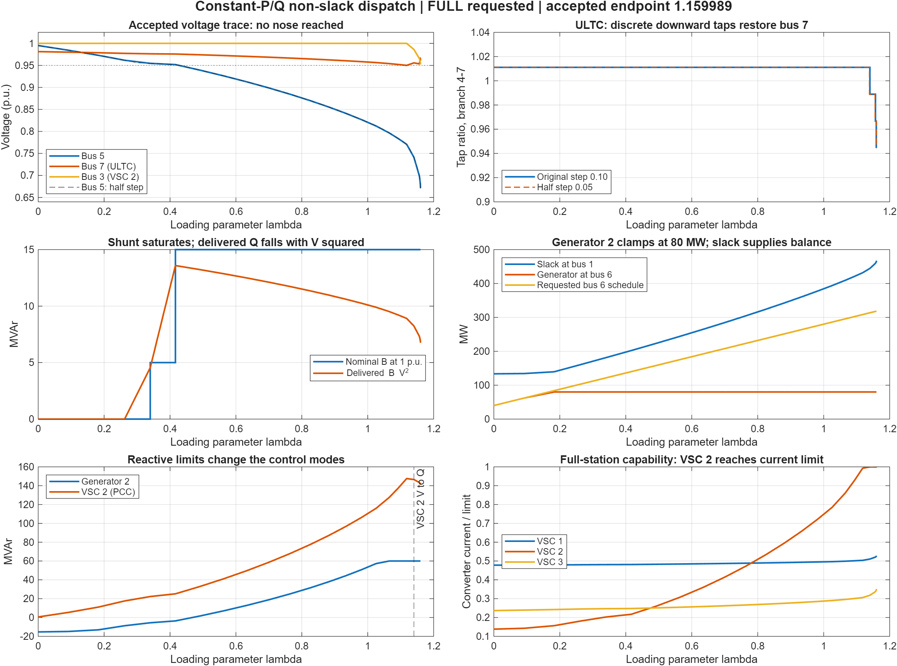

# ULTC and switched-shunt CPF with the updated VSC model

**Verdict:** the accepted ULTC/shunt states and the updated electrical equations pass the checks below. The requested **FULL CPF did not complete**. Both step sizes terminate near λ = 1.15999 during VSC capability re-correction, with VSC 2 essentially at its current limit. This is not a demonstrated voltage-collapse nose or a validated loading margin.

## Scope and reproducibility

The user selected `beerten_constant_pq_nonslack_dispatch`: the existing project Beerten-derived ULTC/shunt study, not the translated author MatACDC case. MATLAB MCP ran the current unified solver through `runcpf_psse`, after project initialization. No production code, electrical parameters, historical outputs, limits or tolerances were changed for this verification.

The main run changes the requested endpoint from NOSE to FULL and retains the saved step of 0.10, minimum step 0.0001, nonadaptive stepping, PSS/E control policy `saturate`, and capability policy `stop`. The sensitivity run changes only the continuation step to 0.05. These are continuation arc-length steps, not fixed increments of λ. Inputs and both complete result structures are preserved separately.

The PCC setpoint semantics and full-station current/upper-voltage capability are active. This saved case has no `vsc_loss` directional metadata: its original loss coefficients remain active. Thus this run verifies compatibility with the directional-loss extension's legacy path, not direction switching. The case still has its original filter-free station parameters. The lower internal-voltage boundary is still absent; this run does not validate compliance with MatACDC's lower-voltage constraint.

## Results

| Quantity | Original step 0.10 | Half step 0.05 |
|---|---:|---:|
| Accepted points, including base | 28 | 45 |
| Solver success flag | 1 | 1 |
| Requested FULL endpoint reached | **No** | **No** |
| Nose detected | No | No |
| Last accepted λ | 1.1599886422 | 1.1599952090 |
| Bus 5 voltage, p.u. | 0.671130 | 0.670351 |
| Bus 7 voltage, p.u. | 0.960502 | 0.960055 |
| Final ULTC tap | 0.944444 | 0.944444 |
| Shunt nominal B / delivered Q, MVAr | 15 / 6.75624 | 15 / 6.74055 |
| VSC 2 current / current limit | 0.99997050 | 0.99999980 |
| VSC 2 PCC Q, MVAr | 141.42679 | 141.37445 |
| VSC 2 DC voltage, p.u. | 1 | 1 |
| Physical/control checks passed | 16/16 | 16/16 |
| Last MATLAB warning | Empty | Empty |

The endpoint difference is 0.00000657 in λ, or about 0.00158 MW in bus-5 demand. Bus-5 endpoint voltage differs by 0.000780 p.u. This supports repeatability of the configured termination, not proof of physical collapse. Low bus-5 voltage also means electrical convergence should not be confused with satisfactory operation.

## Controller behavior

**ULTC:** the original tap 1.0 is not on the specified ten-position 0.90–1.10 grid. Base initialization normalizes it to 1.011111. Subsequent accepted positions are 0.988889, 0.966667 and 0.944444: three adjacent downward moves, which raise the regulated load-side bus-7 voltage. Both traces remain on the tap grid and show no accepted reversal or hunting. All accepted bus-7 voltages satisfy the effective control band.

The nominal voltage band is 0.95–1.03 p.u., but the actual transformer tolerance is **0.005 p.u.** The implementation takes the maximum of VCTOLV and applicable ADJTHR, giving action thresholds of 0.945 and 1.035 p.u. The half-step point at λ = 1.126362, V7 = 0.945744 therefore legitimately keeps its previous tap. This is not an unsettled controller. See `matpower/lib/+mp/psse_xfmr_states.m:41` and `matpower/lib/+mp/psse_xfmr_tap_decision.m:31`.

**Switched shunt:** accepted nominal states in the main trace are 0, 5 and 15 MVAr. The 0.05-step trace explicitly resolves 0, 5, 10 and 15 MVAr. Multiple discrete adjustments can occur within one corrected continuation point. The main run reaches 15 MVAr at λ = 0.416435; it remains available at its upper bound while bus-5 voltage falls below the band. Actual support is Q = B V², so at the endpoint 15 × 0.671130² = **6.75624 MVAr**. This decrease is physical, not loss of a capacitor block. Shunt tolerance is 0.00001 p.u. All accepted states are on the allowed grid and are either in band or saturated at the correct bound.

**VSC 2:** it releases PCC voltage control and becomes fixed-Q AC control when the current constraint binds, while retaining DC voltage control at 1.0 p.u. In the main trace, the first accepted released state is λ = 1.140064; the half-step trace gives λ = 1.126362. These are sampled accepted transitions, not exact event locations. After release, repeated capability projections reduce Q as PCC voltage falls. All accepted converter currents and upper internal voltages satisfy the implemented boundaries. At the main endpoint the internal voltages are 0.893557, 1.010527 and 0.674841 p.u.; the implemented upper limit is 1.15 p.u.

## Dispatch and termination qualifications

**The study's stated dispatch is not maintained after generator saturation.** Its documented request is P2 = 40 + 240λ MW, with the slack supplying only the base balance and incremental losses (`studies/beerten/beerten_constant_pq_nonslack_dispatch.m:32`). However, the enabled generic thermal curve uses the non-slack generator's 100 MVA base and caps P at 0.8 × 100 = **80 MW**, despite matrix PMAX = 300 MW. The active-set implementation assigns that projected P to both base and target and continues; the AC slack supplies the remainder. See `matpower/lib/gen_capability_curve.m:227` and `matpower/lib/runcpf_vsc_mtdc.m:2141`–2179.

The requested schedule reaches 80 MW at λ = **1/6 = 0.166667**. The first accepted clamped point is λ = 0.182850. By the endpoint the requested P2 would be 318.397 MW, but actual P2 is 80 MW and slack P is 467.306 MW. Generator 2 subsequently reaches Q = 60 MVAr and switches from PV to PQ; the main trace first records that state at λ = 1.065432. This is the generic capability constraint, not the original ±300 MVAr box.

**The terminal label does not establish a physical feasibility boundary.** The code reduces the step after VSC active-set re-correction fails and then reports `VSC_CAPABILITY_LIMIT` with success = 1 when further allowed reduction is unavailable (`matpower/lib/runcpf_vsc_mtdc.m:540`–705). The final failed trial step is 0.0001953125; halving it would fall below the saved minimum of 0.0001. The result explicitly records `requested_endpoint_reached = false`, `nose_detected = false` and `stability_margin_validated = false`. Failure metadata does not distinguish an exhausted capability-settling iteration budget from an inner electrical re-correction failure. Do not infer physical infeasibility from this label alone.

**Event records require care.** There are 42 main-run event entries; some control events belong to rejected trial points. Counts of actual tap/shunt movements above come from accepted state arrays. Also, the generator event's reported `lambda_event = 0.1788495` has `margin_event = −2.92389 MW`, rather than zero. The localization helper targets 75% of the negative candidate margin (`matpower/lib/runcpf_vsc_mtdc.m:2248`), so that event field must not be interpreted as the exact physical crossing. The exact 80 MW schedule crossing is analytically 1/6.

## Verification and bounded recommendations

The audit reconstructs AC nodal balances from the original AC network plus PCC injections, DC balances from the resistive conductance matrix, bridge balance from Pconv + Pdc + Ploss, and converter voltage/current/internal power from the full station map. It compares mapped currents against internal apparent power divided by internal voltage, independently of the capability projection. Across the main accepted trace, maximum errors are:

| Check | Maximum absolute error |
|---|---:|
| AC nodal complex power | 7.943 × 10⁻⁷ MVA |
| DC nodal power | 2.268 × 10⁻⁷ MW |
| Converter bridge balance | 6.548 × 10⁻⁹ MW |
| Station internal complex power | 5.010 × 10⁻⁹ MVA |
| Station internal voltage | 6.995 × 10⁻¹³ p.u. |
| Station current / rated-current base | 1.839 × 10⁻¹¹ p.u. |
| C1/C3 constant PCC P/Q schedules | 2.292 × 10⁻⁷ MW or MVAr |

All 16 explicitly recorded checks pass in each run; no assertions were suppressed. The audit criteria and individual checks are in `audit_control_cpf.m` and `audit.json`. This is a focused run audit, not a rerun of the whole project regression suite.

Before interpreting this scenario as the intended non-slack dispatch study, make its limit policy explicit: stop when that participant's 80 MW capability is reached, or expressly authorize a redistribution rule and document the new loading direction. Do not increase its rating merely to obtain a longer curve. For full constrained continuation, first retain detailed failure-stage diagnostics and investigate continuation of the coupled current-limit/AC/DC equations; do not disable capability or claim the existing configured stop is a nose. Correct event-location semantics independently of the accepted-state electrical solution. These are recommendations only; no production changes were made.

## Files

- `run_control_cpf.m`, `inputs.mat`: original selected scenario and main execution.
- `full_run.mat`, `half_step_run.mat`: saved solver results, options and warning fields.
- `audit_control_cpf.m`, `audit.json`: independent residual/control checks and numerical evidence.
- `accepted_trace.csv`, `half_step_trace.csv`: all accepted points.
- `events.json`, `summary.json`, `run.log`: reported events and execution records.
- `control_cpf.png`, `REPORT.html`: illustrated summary; HTML embeds its plot for standalone viewing.
