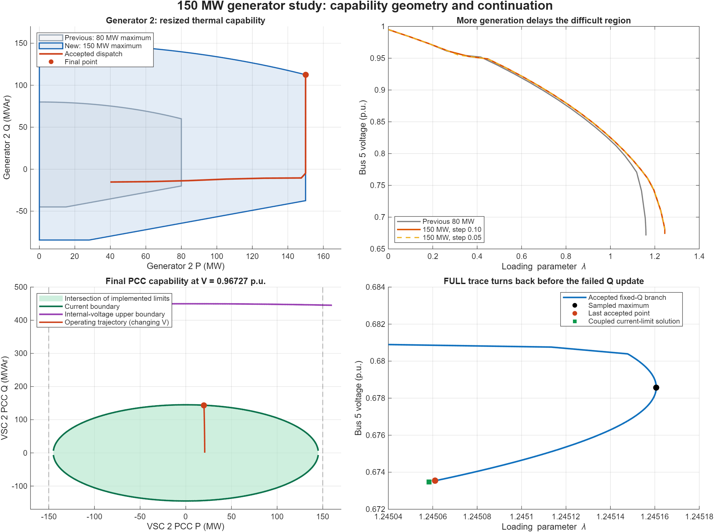
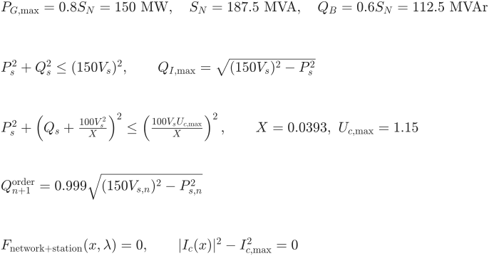
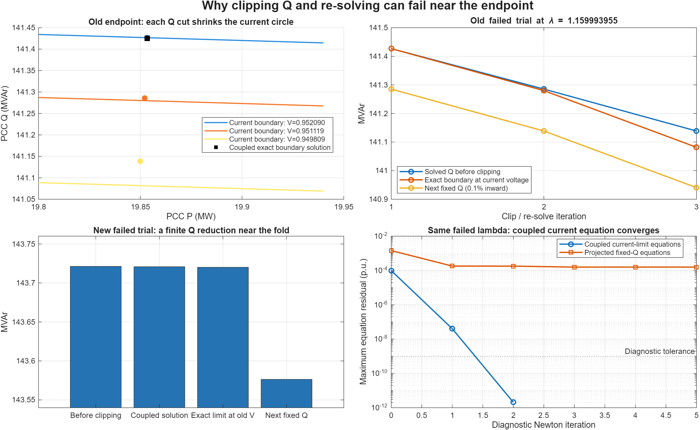
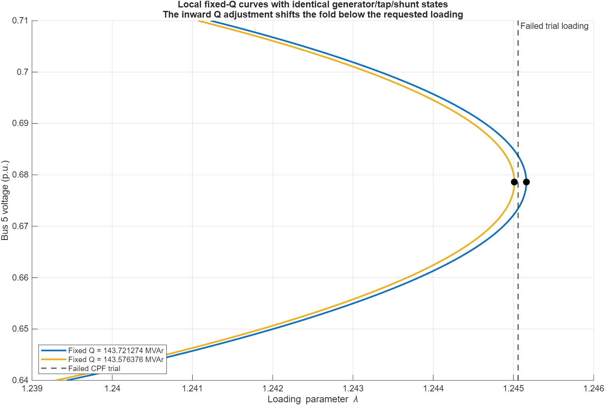

# Generator 2 at 150 MW: what fails near the CPF endpoint?

**The study now has a 150 MW active-power capability for generator 2. The failure near the endpoint is primarily a problem with how the limit is imposed: clipping converter Q and then solving a fixed-Q power flow can destroy the local solution that the solver was following. A simultaneous solution of the network and converter current-limit equations succeeds at the same failed loading. This demonstrates a limitation of the current enforcement procedure; it does not establish the complete constrained loading margin.**

## The requested change

Generator 2 is the conventional generator at **AC bus 6**. VSC 2 is the converter connected to **AC bus 3**; they are different devices.

The existing generic thermal curve has Pmax = 0.8 Snom. A 150 MW maximum therefore requires a **187.5 MVA capability base**, not a 150 MVA base. This preserves the existing curve shape and raises its upper reactive corner at maximum P from 60 to **112.5 MVAr**. The change is explicit generator-capability metadata in `studies/beerten/beerten_constant_pq_nonslack_dispatch.m:22`–29; it applies to this study's base and target. The electrical MBASE column and original matrix PMAX/Q boxes remain as before. The capability metadata overrides the MBASE fallback. The study description now accurately says that the generator clamps at its limit and the slack balances the remainder. The generic curve itself and production solvers were not edited.

The requested dispatch reaches 150 MW at λ = (150−40)/240 = **0.458333**. The first accepted clamped point depends on the continuation step: 0.533722 in the 0.10-step run and 0.491279 in the 0.05-step run. Those are sampled transitions, not exact crossing locations.

## What the new runs show

| Quantity | Previous 80 MW run | New 150 MW, step 0.10 | New 150 MW, step 0.05 |
|---|---:|---:|---:|
| Last accepted λ | 1.1599886422 | 1.2450610054 | 1.2452543009 |
| Highest accepted λ | 1.1599886422 | 1.2451606312 | 1.2452543009 |
| Accepted points | 28 | 129 | 45 |
| Terminating active-set stage | VSC capability | VSC capability | Generator capability |
| Generator 2 P / Q, MW / MVAr | 80 / 60 | 150 / 112.5 | 150 / 112.48250 |
| Generator 2 final AC mode | PQ | PQ | PV |
| VSC 2 Q at PCC, MVAr | 141.42679 | 143.72127 | 143.84536 |
| VSC 2 current / limit | 0.99997050 | 0.99997819 | 0.99757340 |
| Bus 5 voltage, p.u. | 0.671130 | 0.673537 | 0.680698 |
| Bus 7 voltage, p.u. | 0.960502 | 0.953674 | 0.957451 |
| ULTC tap | 0.944444 | 0.966667 | 0.966667 |
| Shunt nominal B, MVAr at 1 p.u. | 15 | 15 | 15 |
| FULL requested endpoint reached | No | No | No |

The higher generator capability postpones the difficult region by roughly 0.085 in λ, equivalent to about 20.4 MW of extra bus-5 demand. It also changes reactive support, so this is not an isolated active-power-only sensitivity. All **16 electrical/control audit checks pass in each new run**, including PCC schedules, AC/DC balances, full station mapping, current/upper-voltage capability, and accepted tap/shunt states. Maximum main-run AC nodal error is 8.14×10⁻⁷ MVA. No MATLAB warnings were captured in the new main or half-step runs.

The switched shunt is fully inserted and delivers 6.805 MVAr at the main endpoint because its output scales with voltage squared. Generator 2 is at its 112.5 MVAr corner and has released voltage control. VSC 2 has also released AC-voltage control, but still regulates DC voltage at 1 p.u. The AC slack at bus 1 supplies 418.566 MW at the main endpoint. These exhausted sources of incremental voltage support make the network very sensitive to a further reduction in converter Q.

## Read the capability curves at the correct terminal

The geometry in the figure uses **PCC P, PCC Q and PCC voltage**, consistently. It does not mix internal converter power with PCC voltage. The production calculation still uses the complete station map, including transformer, filter and reactor (`matpower/lib/vsc_station_map.m:1` and `matpower/lib/vsc_station_capability.m:11`).

For this particular VSC 2, the filter and series resistance are zero, and transformer plus reactor reactance is **X = 0.0001 + 0.0392 = 0.0393 p.u. on 100 MVA**. Therefore internal and PCC current are identical, and the full-station current boundary simplifies exactly to the current circle shown below. The VSC rating is 150 MVA with a fixed current limit of 1.5 p.u. on the system base, or 1 p.u. on its own 150 MVA base. This 150 MVA VSC rating is unrelated to the conventional generator's new 150 MW limit.

In the station equations above, P and Q are in MW and MVAr, V and U are per-unit voltage magnitudes, and X is on the system 100 MVA base. The first equation concerns the conventional generator. The final equation means **replace the fixed-Q converter equation with the current-limit equation**, not append a constraint to an unchanged square system.

At the new final PCC voltage of about 0.96727 p.u., the current circle has radius approximately 145.09 MVA in the PCC P–Q plane. VSC 2 sits near P = 19.87 MW, Q = 143.72 MVAr, near the top of that circle. Its internal voltage is only **1.02570 p.u.**, well below the implemented 1.15 upper limit. Thus **current is the active converter constraint; the internal-voltage upper boundary is not causing this stop**. The retained |P|≤150 MW ceiling is also inactive. No lower internal-voltage limit is implemented in this study.

The shaded area is the intersection of the implemented boundaries at the specified voltage. The trajectory was obtained at changing PCC voltages; it should not be interpreted as a fixed-voltage sweep. As voltage falls, the current circle shrinks even though the current rating has not changed.

## The actual failing sequence in the original 80 MW run

The instrumentation was added to separately named solver copies under this output directory. Their accepted λ and converter arrays match the corresponding original runs exactly. Production solver logic and settings were not changed to obtain the diagnostic replay.

At the repeated rejected trial **λ = 1.15999395534**, the saved sequence is:

| Iteration | Solved PCC voltage | Solved Q before clipping | Exact Q ceiling at that voltage | Next fixed-Q order |
|---|---:|---:|---:|---:|
| 1 | 0.952089514 | 141.426792272 | 141.426716166 | 141.285289450 |
| 2 | 0.951119296 | 141.285289450 | 141.279938399 | 141.138658461 |
| 3 | 0.949808748 | 141.138658452 | 141.081733857 | 140.940652124 |

Q values are MVAr. The first violation is only **0.0000761 MVAr**, yet the next order cuts Q by **0.141503 MVAr**. This happens because `runcpf_vsc_mtdc.m:1694` supplies a default inward fraction of 0.001, and `:1625`–1634 applies it to projected Q when P is preserved. It is a **0.1% Q reduction**, not a mathematically equivalent 0.1% current reserve.

Reducing Q lowers the solved PCC voltage. The lower voltage reduces the allowable Q on the current circle. The previously projected point can therefore be outside the newly evaluated circle, prompting another reduction. In these two successful re-solves, the reduction of the Q ceiling is slightly larger, then substantially larger, than the preceding reduction of Q itself. This is evidence that the local clip/re-solve iteration is not contracting. The third fixed-Q power flow fails; the instrumentation identifies an **inner electrical solve failure**, not exhaustion of the ten outer capability iterations. Repeated continuation step reductions eventually reach the configured minimum and terminate.

## A numerical explanation of the new 150 MW failure

The new run's last failed candidate has **λ = 1.24505833708**:

| Quantity | MVAr |
|---|---:|
| Solved Q before clipping | 143.721274015 |
| Exact Q boundary at the candidate voltage | 143.720096044 |
| Fixed-Q order after the inward adjustment | 143.576375948 |
| Q from a simultaneous network/current-limit solution | 143.720816389 |

The original current violation corresponds to only **0.001178 MVAr**, but the algorithm reduces Q by **0.144898 MVAr**. Near a fold, that small absolute loss of support can eliminate the local fixed-Q power-flow solution at the requested load.

To test this directly, a separate diagnostic follows the local electrical branch using **bus-5 voltage as the continuation parameter**, allowing λ to be an unknown. The tap, shunt, generator P/Q and converter Q order remain fixed in each sweep. This is a local branch calculation, not a replacement controls-active CPF or an assertion that every plotted point satisfies all operating constraints.

| Local fixed-Q branch | Sampled maximum λ |
|---|---:|
| Before clipping: Q = 143.721274015 MVAr | 1.24516063028 |
| After clipping: Q = 143.576375948 MVAr | 1.24501120816 |
| Failed trial λ | **1.24505833708** |

Both local branch sweeps have maximum equation residual below 6.4×10⁻¹² p.u. The attempted λ lies **between the two folds**: the old fixed-Q branch can support it locally, while the newly imposed fixed-Q branch cannot in the neighborhood traced. This supports the failure explanation much more strongly than the termination label alone. It is not a global proof excluding every possible distant solution.

Now replace the VSC 2 fixed-Q equation with its exact current-limit equation and solve the full network and station equations together, keeping DC-voltage regulation and the same generator/tap/shunt state. At that failed λ, this converges in **two Newton updates**, to:

- PCC voltage **0.9672490255 p.u.**, P **19.86623212 MW**, Q **143.72081639 MVAr**.
- Converter current exactly at its limit to numerical precision; residual **2.08×10⁻¹² p.u.**.
- All converter current/upper-voltage boundaries satisfied, and tap/shunt control acceptance satisfied under the declared saturation policy. The shunt remains at its physical upper bound.

The same diagnostic also converges at the original 80 MW run's failed λ, with Q = 141.42530446 MVAr and residual 3.82×10⁻¹⁰ p.u. This proves that those failed trials have a nearby solution under the **exact current-boundary formulation**, even though the existing inward fixed-Q enforcement fails. It does not prove satisfaction of the existing artificial inward-Q policy, nor certify dynamic stability or the entire constrained continuation curve.

A small local scan with frozen discrete controls also converges at new-case λ = 1.2450683371 and 1.2451583371. A larger trial at 1.2460583371 does not converge; that diagnostic failure is not treated as a certified physical maximum.

## Two additional findings that affect interpretation

**The FULL trace already turns back locally.** In the new main run, λ reaches a sampled maximum of **1.24516063122** and then decreases over 75 accepted steps. The loading component of the tangent changes sign, confirming a local turn of that fixed-Q/PQ branch. However, the raw result says `nose_detected = false`. The code only activates nose event detection for `stop_at = 'NOSE'` (`runcpf_vsc_mtdc.m:837`–839), and termination metadata infers detection from a recorded NOSE event (`:974`). Hence the raw FULL-mode flag is not evidence that no turn occurred. The true limit-following branch has not been fully traced.

**The two step sizes encounter different active-set transitions.** The half-step run reaches λ = 1.24525430094 while generator 2 is still PV, with Q = 112.48250 MVAr. The next rejected candidate asks for 112.51648 MVAr. Applying the 112.5 MVAr generator boundary and releasing voltage control fails in the generator re-correction stage. The main run made that PV-to-PQ transition earlier and later fails in VSC Q re-correction. Both endpoints are in the same narrow region, but their mode histories differ. Report this sensitivity instead of treating the two stopping flags as interchangeable physical limits.

## What should change next?

The capability geometry is consistent with the station equations in these runs. The next bounded improvement is **coupled enforcement**, rather than another geometric curve change:

1. When a VSC binds on current, replace its AC voltage/Q control equation with the full-station current-boundary equation and retain its DC control equation. Q then follows the moving boundary simultaneously with voltage and losses.
2. Keep λ free in the continuation corrector near folds, including during active-set transitions; a fixed-λ re-solve can fail where continuation itself can proceed.
3. If a current reserve is desired, define it on the current limit and solve that boundary consistently. Do not use an unconditional inward Q jump as a substitute for current reserve.
4. Coordinate generator PV/PQ and converter-limit transitions, recompute the tangent, and validate every accepted point against all active constraints.
5. Record turns in FULL mode and retain the exact failed inner stage, requested order, mismatch and iteration history. Keep configured termination distinct from a proven physical boundary.

Only the requested generator capability and its study documentation were changed in production. The coupled solves, branch sweeps and logging are isolated diagnostic artifacts, not new production enforcement. The new capability passed direct 150 MW/112.5 MVAr checks, both CPF trace audits pass 16/16 checks, and MATLAB Code Analyzer reports no issues in the edited study. Historical outputs remain intact.

## Reproducibility and evidence

All calculations used MATLAB MCP after `iniciar_proyecto`; no CLI fallback was used. Existing electrical parameters, convergence tolerances and enforcement policies were retained in the production runs. Only the study capability and the explicitly identified half-step sensitivity differ. Direction-dependent loss metadata is absent from this scenario, so its legacy loss coefficients remain active.

- `main_run.mat`, `half_step_run.mat`: full production results, inputs/options and warnings.
- `accepted_trace.csv`, `half_step_trace.csv`, `audit.json`: accepted-state evidence and 16 checks per run.
- `instrumented_run.mat`, `old_instrumented_run.mat`, `half_instrumented_run.mat`: exact diagnostic replays, including rejected inner iterations.
- `make_diagnostic_copy.py`, `instrumentation.diff`: reproducible logging-only solver copies; the copies have distinct function names and do not shadow production functions.
- `coupled_limit_probe.m`, `coupled_boundary_probes.mat`, `local_boundary_scan.mat`: isolated current-boundary solves and their limitations.
- `frozen_q_fold_probe.m`, `frozen_Q_folds.mat`: independent voltage-parameterized local electrical branches.
- `plot_limit_diagnosis.m`, `diagnosis.json`: figures and detailed numerical examples. Equations are rendered from LaTeX by MATLAB.
- `study_before.m`: pre-change study preserved for comparison.
