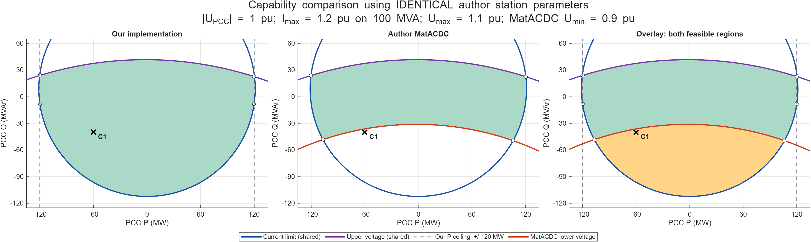
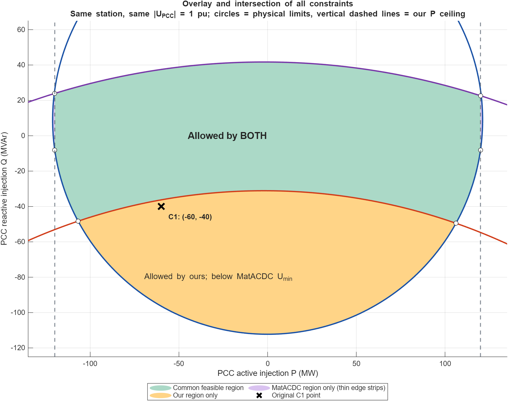

# Our VSC capability versus archived MatACDC

The comparison uses **identical author station parameters** from the new MatACDC translation, at PCC voltage **1.0 pu**. It does not compare the older filter-free reconstruction with the author station.

The axes are **PCC injections** in MW/MVAr. The shared current limit is 1.2 pu on 100 MVA, corresponding to our 120-MVA current base; the shared upper internal-voltage limit is 1.1 pu. The author lower-voltage limit is 0.9 pu. The displayed arcs are the portions of the complete circles relevant to the operating region.

- **Green:** feasible under both formulations in the overlay. In the first two panels, green denotes the feasible region of the named implementation.
- **Amber:** accepted by our formulation, excluded by MatACDC's lower internal-voltage boundary.
- **Purple edge strips:** accepted by MatACDC, excluded by our additional ±120 MW PCC active-power ceiling.
- **White circles:** feasible boundary intersection vertices. The overlay markers belong to the common region.
- **Black ×:** C1's original PCC point, −60 MW / −40 MVAr. It lies inside our region but outside MatACDC's region because its internal voltage is 0.889865 pu, below 0.9 pu.

The blue current circle and purple upper-voltage circle coincide exactly between the models for these parameters. The red lower-voltage circle is present only in MatACDC's constraints. The dashed vertical active-power ceiling is present only in our constraints. At this PCC voltage, that ceiling removes only narrow strips near the left and right extremes.

The filled feasible region is an **intersection of inequalities**, not the intersection of the curves as lines:

| Formulation | Simultaneous requirements |
|---|---|
| Ours | Within current circle; within upper-voltage circle; −120 ≤ PCC P ≤ 120 MW |
| MatACDC | Within current circle; within upper-voltage circle; outside lower-voltage circle |
| Common region | All four requirements |

This comparison concerns capability geometry at fixed PCC voltage. It does not imply identical saturation priorities, DC slack handling, or a complete limit-enforced network power-flow solution.

[Zoom of the additional active-power ceiling](active_ceiling_zoom.png) · [Comparison PDF](comparison.pdf) · [Overlay PDF](overlay.pdf)

Verification: the current/upper-voltage circle centers and radii from the production `vsc_capability_curve` were checked against independently constructed author π-equivalent formulas. Grid membership was checked at **675 points** against the production capability evaluator. Exact circle/line intersection vertices were calculated separately from the shading grid. Calculations used MATLAB MCP; no production code or case data were changed. Historical outputs were preserved.

The three-panel plot, large overlay and refined edge zoom were visually inspected. MATLAB emitted two vector-export performance warnings while generating the PDFs; the exports completed. These were rendering warnings, not solver failures. The zoom uses a separate finer mesh so its narrow feasible strip is accurately visible.

Files: [reproducible MATLAB script](plot_comparison.m), [numerical evidence](evidence.json), [MATLAB data](evidence.mat).

Code sources: [our capability evaluator](../../matpower/lib/vsc_station_capability.m), [our full station map](../../matpower/lib/vsc_station_map.m), [our case metadata](../vsc_directional_losses_20260916/case5_matacdc_directional.m), [archived MatACDC circle construction](../beerten_validation_batch6_20260911/reference/MatACDC1.0/convlim.m).
