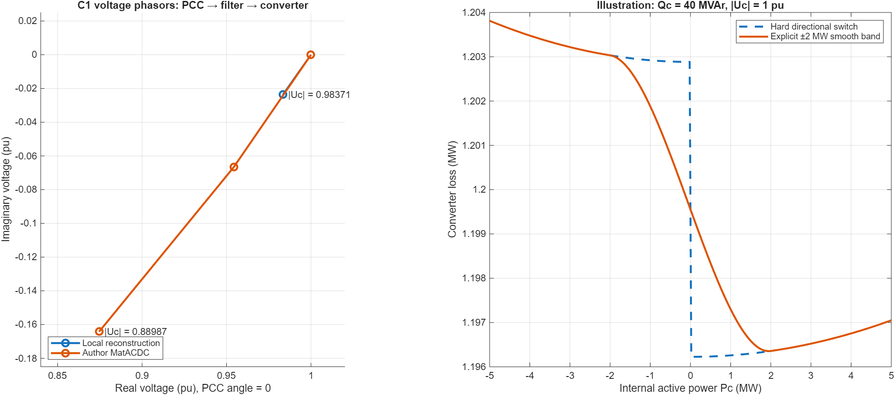

# Why internal voltage differs, and why losses can depend on direction

Verified 2026-09-16. The directional-loss extension is implemented in unified PF, sequential PF, and their CPF paths. Existing case parameters and historical results were preserved. A separate translated author case with the new metadata is supplied as [case5_matacdc_directional.m](case5_matacdc_directional.m).

## The internal voltage is set by station impedance and reactive current

For C1, both cases prescribe −60 MW and −40 MVAr at a 1.0-pu PCC. Rotate the voltage reference so the PCC phasor is real. On the 100-MVA base, with current positive from converter towards the grid:

\[
\underline U_s=1,\quad s_s=-0.6-j0.4,\quad
\underline I_s=(s_s/\underline U_s)^*=-0.6+j0.4.
\]

With no tap, phase shift or branch charging, the exact station equations are

\[
\underline U_f=\underline U_s+Z_t\underline I_s,\quad
\underline I_c=\underline I_s+jB_f\underline U_f,\quad
\underline U_c=\underline U_f+Z_r\underline I_c.
\]

These are phasor sums. Voltage magnitudes cannot simply be added or subtracted as scalar impedance drops. The passive branch loss is also not the same quantity as the voltage-magnitude change.

| C1 station data | Local reconstruction | Author MatACDC |
|---|---:|---:|
| Transformer X, pu | 0.0001 | 0.1121 |
| Reactor X, pu | 0.0399 | 0.16428 |
| Total series X, pu | 0.0400 | 0.27638 |
| Filter B, pu | 0 | 0.0887 |
| PCC voltage magnitude, pu | 1.000000 | 1.000000 |
| Filter-bus voltage magnitude, pu | 0.999960 | 0.956585 |
| Internal voltage magnitude, pu | 0.983707 | 0.889865 |

The author station's total series reactance is about 6.9 times larger. The negative PCC Q means the station absorbs reactive power from the grid. For intuition, neglect resistance and the filter: the real component of the series voltage change contains X·Q, which is negative here. Increasing X makes that reduction much larger. The active component also creates a substantial phase-angle change.

Direct substitution gives:

\[
\underline U_{c,\mathrm{local}}=0.9834231-j0.0236154,
\qquad |U_{c,\mathrm{local}}|=0.983706603.
\]

\[
\underline U_{f,\mathrm{author}}=0.95426-j0.06666,\quad
\underline I_{c,\mathrm{author}}=-0.594087258+j0.484642862,
\]

\[
\underline U_{c,\mathrm{author}}=0.874583462-j0.164208190,
\qquad |U_{c,\mathrm{author}}|=0.889865474.
\]

A controlled station-only calculation at the same PCC P/Q/voltage isolates the contributions:

| Configuration | Internal voltage magnitude |
|---|---:|
| Local station | 0.983706603 pu |
| Author transformer/reactor, filter omitted | 0.903713451 pu |
| Full author station, including filter | 0.889865474 pu |

Thus the larger impedances account for most of the difference; the filter contributes a further reduction at this particular absorption setpoint. A capacitive filter does not guarantee a higher internal converter voltage when **PCC reactive power is held fixed**: the converter changes its current to maintain that external order. This is not a solver disagreement. The converter semiconductor loss law does not directly appear in these fixed-PCC station equations. It changes DC power balance and the balancing station's operating point.

## Why a direction-dependent loss fit is reasonable

The bridge has IGBTs and antiparallel diodes, whose conduction drops, switching energies and diode reverse-recovery losses differ. Reversing active power changes the voltage/current phase relationship and the duty carried by these devices. Total losses at equal RMS current can therefore differ between power directions. This is supported by the [Infineon manufacturer derivation](https://community.infineon.com/t5/Knowledge-Base-Articles/Calculate-IGBT-losses-for-a-SPWM-voltage-source-converter/ta-p/381757). It does not imply that a passive resistance changes with power direction.

[Beerten et al. 2012, equations 10–11](https://lirias.kuleuven.be/retrieve/246525) use a current-based aggregate quadratic approximation:

\[
P_\mathrm{loss}=a+bI_c+c(P_c)I_c^2,\qquad
I_c=\frac{\sqrt{P_c^2+Q_c^2}}{S_b|U_c|}.
\]

Allowing separate fitted c coefficients is useful and consistent with the archived MatACDC implementation. It remains an approximation: modulation, reactive operation, switching frequency, topology and temperature also matter. Neither the numerical coefficients nor a universal ordering of the two directions should be assumed for every converter technology.

The archived `calclossac.m`, lines 40–50, uses `LossCrec` for positive internal Pc and `LossCinv` for negative internal Pc. Because those labels conflict with the usual physical interpretation of positive AC injection, the new API names the coefficients by **internal Pc sign**. The translated author case uses c_positive=0.0807953511 and c_negative=0.1224112581 MW/pu-current², including its physical-current-to-pu conversion. Existing reconstruction coefficients were not replaced with those values.

## What changed

The optional `mpc.vsc_loss` struct supplies `c_positive`, `c_negative`, and optional `transition_MW`; scalars or one entry per VSC row are accepted. Existing cases without it keep `LOSS_C` in both directions. Save/load preserves the metadata, and CPF rejects changing equipment coefficients between base and target. The shared selector is called on every evaluation, so a station is not permanently assigned a direction from its initial setpoint.

Direction uses actual **internal PCONV**, never PCC PAC_SET or the DC schedule. A new regression explicitly checks a case where PCC P is negative but internal Pc is positive because of passive station losses.

For hard switching, the coefficient is selected by sign; at exactly zero internal active power, the mean of the two coefficients is used. The archived code instead makes the quadratic contribution zero at that one point; that artifact was not copied. Nonzero reactive power means nonzero converter current even at Pc=0. Unequal directional fits therefore have a discontinuity at reversal unless a transition model is introduced.

An explicitly selected positive `transition_MW` provides a C1 cubic blend in a finite band. Its derivative is included in the unified Newton and CPF Jacobian. This regularization is optional and documented, not silently applied. The illustrated 2-MW half-width is a test choice, not device calibration. Full equations, units and behavior are in [VSC_DIRECTIONAL_LOSS_CONTRACT.md](../../docs/VSC_DIRECTIONAL_LOSS_CONTRACT.md).

## Verification and numerical limitations

- Directional regression: **242 passed, zero failed**. Includes both PF solvers in both directions, independent losses and balances, legacy equality, derivative checks, CPF crossing of internal Pc=0 with nonzero Q, invalid input rejection, persistence, and invariant CPF equipment data.
- Existing PCC/full-station regression: **141/141 passed**. These are the regressions rerun for this change; the full 330-check legacy suite was not rerun in this turn.
- Author-case unified PF: **success=true, 4 iterations**. Dynamic coefficient selection differs from the prior fixed-coefficient base solution by at most **1.27×10⁻¹² MW/MVAr**.
- Author-case sequential PF: **success=false at the default 20 iterations**; with an explicitly documented test budget of 100, **success=true in 61 iterations**. Maximum power difference from unified PF is **4.19×10⁻⁶ MW/MVAr**. Tolerances and production iteration defaults were not changed.
- The author's C1 internal voltage remains below 0.9 pu. Capability limits were disabled in the reference comparison, so numerical agreement does not certify equipment feasibility.
- Code Analyzer found no issues in the new coefficient helper, loss evaluator or changed unified solver. The existing CPF file has an unused-function warning and `savecase` has existing style/unused-variable findings; the changes introduce no findings in their edited lines.
- Scientific calculations ran through MATLAB MCP after project initialization. The phasor and loss plot was visually inspected. The old outputs were preserved.

Primary implementation locations: [shared selector](../../matpower/lib/vsc_loss_coefficients.m), [loss evaluator](../../matpower/lib/calc_vsc_losses.m), [unified residual/Jacobian](../../matpower/lib/runpf_vsc_mtdc_unified.m) at lines 863 and 1071–1088, [sequential state update](../../matpower/lib/update_vsc_state.m) line 46, [CPF metadata validation](../../matpower/lib/runcpf_vsc_mtdc.m) line 4220 and [persistence](../../matpower/lib/savecase.m) line 578.

Evidence: [directional_regression.json](directional_regression.json), [reference_and_phasors.json](reference_and_phasors.json), [reproducible reference/phasor calculation](verify_reference_and_phasors.m), and [new regression test](../../tests/t_vsc_directional_losses.m). Original source snapshots are under `before/`; `changes.diff` records this task's changes.
