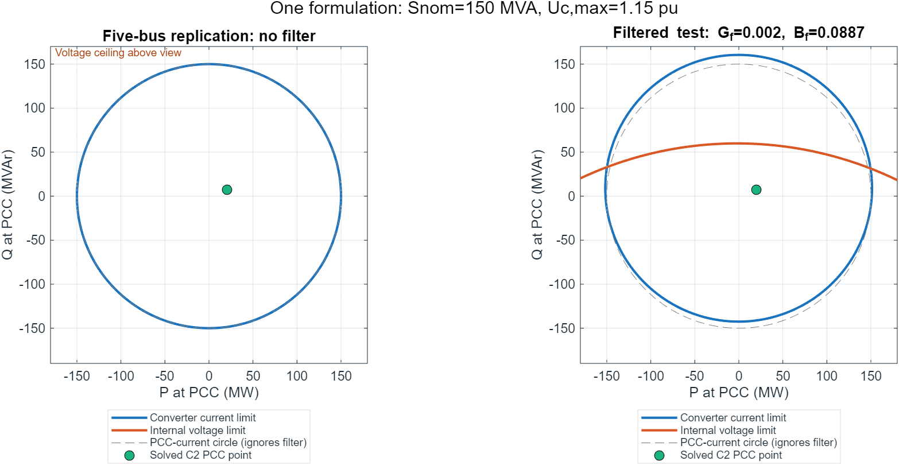

# Five-bus Beerten comparison and PCC model migration

This work concerns `case5_vsc_mtdc_beerten`: five original AC buses, two
generators, seven AC lines, and three VSC stations connected at buses 2, 3 and 5.
There is **no ULTC, switched shunt, bus 6 or bus 7** in this comparison.
The case's numerical data have not been changed.

## Which reference?

The local case describes itself as a reconstruction of Beerten, Cole and Belmans'
2010 PES paper. That paper uses a **filter-free lumped station impedance**.
Consequently, “our filter is missing” is not a demonstrated discrepancy with the
2010 model. The paper's published result tables do not provide a complete numerical
input dataset; they cannot establish an exact impedance/resistance match.

The archived **author-supplied MatACDC 1.0 five-bus case** is a complete,
reproducible comparison, but is a later, more detailed station benchmark. The
differences below are verified against those input files, rather than inferred
from rounded 2010 result tables.

| Parameter | Local five-bus replication | MatACDC 1.0 author case |
|---|---|---|
| System power base | 100 MVA | 100 MVA AC/DC |
| AC base voltage | 230 kV | 345 kV |
| DC base voltage | 300 kV | 345 kV |
| DC poles | No explicit pole multiplier | Two poles |
| DC resistance, links 2–3 / 3–5 / 2–5 | 0.02633 / 0.02337 / 0.03601 pu | 0.052 / 0.052 / 0.073 pu **per pole** |
| Station transformer, all C1–C3 | \(j0.0001\) pu | \(0.0015+j0.1121\) pu |
| Filter shunt | \(G_f=B_f=0\) | \(G_f=0, B_f=0.0887\) pu |
| Reactor C1 | \(0.0009615+j0.0399\) pu | \(0.0001+j0.16428\) pu |
| Reactor C2 | \(j0.0392\) pu | Same author reactor as C1 |
| Reactor C3 | \(0.000785+j0.0399\) pu | Same author reactor as C1 |
| Branch charging / transformer phase shift within stations | Zero / zero | No corresponding nonzero quantities in author station data |
| Bridge loss (a) | 1.1033 MW | 1.103 MW |
| Bridge loss (b) | 0.1999949 MW per pu current | 0.887 kV; 0.148437591 MW/pu current on its AC base |
| Bridge loss (c), C1/C2/C3 | 0.1466667 / 0.2222333 / 0.2222333 MW per pu current squared | 2.885 / 4.371 Ω; 0.080795351 / 0.122411258 MW/pu current squared on its AC base |
| Loss coefficient direction dependence | Fixed stored coefficient per station | Separate rectifier/inverter coefficients |
| Converter current rating | Inferred from 150 MVA: 1.5 pu on 100 MVA base | Explicit 1.2 pu |
| Maximum internal voltage | Default 1.15 pu | 1.1 pu |
| Minimum internal voltage | Not enforced by local capability formulation | 0.9 pu in author data |
| AC line ratings, all seven lines | 250 MVA | 100 MVA |
| G1 active limits | −500 to 500 MW | 10 to 250 MW |
| G2 active limits | 0 to 300 MW | 10 to 300 MW |
| Initial DC voltage guesses | 1.008 / 1.000 / 0.998 pu | 1 / 1 / 1 pu |

The tiny transformer reactance preserves the explicit auxiliary-node topology;
almost all of the local lumped impedance is assigned to the reactor. It should
not be interpreted as a documented physical transformer nameplate.

The AC line **R/X/B values**, five-bus connectivity, loads (165 MW / 40 MVAr),
G2 schedule (40 MW), AC generator voltage targets and generator Q limits match
the archived author AC case. The converter PCC schedules also now have the same
meaning: C1 \(P_s=-60, Q_s=-40\); C3 \(P_s=35, Q_s=5\); C2 controls
\(U_s=1, U_{dc}=1\), with its P/Q determined by the balances. Other stored
`PAC_SET`, `QAC_SET`, `PDC_SET`, `VAC_SET` and `VDC_SET` entries can be initial
values or inactive orders depending on the control mode, not simultaneous constraints.

DC resistance comparison needs two qualifications. Dividing the author's values
by two gives 0.026 / 0.026 / 0.0365 pu for a single equivalent conductance with
the author's voltage normalization. Those still differ from the local numbers.
If also expressed on the local **300 kV physical voltage base**, the equivalent
values are 0.034385 / 0.034385 / 0.04827125 pu. A near match of raw pu numbers
does not prove that the underlying physical DC circuits match.

## Changes implemented

`PAC_SET/QAC_SET` and result `PAC/QAC` now refer to the **PCC**, in MW/MVAr,
positive into the AC grid. `PCONV/QCONV`, added as output columns 45/46, preserve
the internal converter quantities used by bridge losses and power balance.
Both PF methods, the analytic Jacobian, CPF initialization, capability audit,
active-set enforcement, dispatch documentation and affected tests follow this
contract. The internal proxy generator continues to represent internal power.
Transformer/reactor loss reporting has also been repaired in the unified result.

For example, the newly solved five-bus C1 delivers exactly −60 MW / −40 MVAr at
the PCC. Its internal values are approximately −59.950 MW / −37.920 MVAr.
They differ by about 0.050 MW and 2.080 MVAr of station consumption.
See [fresh numerical results](five_bus_results.csv) for all three stations.

The capability formulation now maps PCC power through the actual transformer,
filter and reactor to obtain internal converter current and voltage. It includes
resistance, filter conductance/susceptance, branch charging and transformer phase
shift. The same equations apply with a missing filter or zero/tiny impedances;
there are no separate physical capability models selected by case type.

For the common case without branch charging or phase shift:

\[
i_s=\frac{s_s^*}{U_s},\quad
i_c=(1+y_fz_t)i_s+y_fU_s,
\]
\[
u_c=(1+z_ry_f)U_s+\bigl[z_t+z_r(1+y_fz_t)\bigr]i_s.
\]

The current and voltage constraints are simply

\[
|i_c|\le I_{c,\max},\qquad |u_c|\le U_{c,\max}.
\]

**PCC P/Q with PCC voltage is the correct combination.** The earlier terminal
mismatch is removed. With a filter, however, \(i_c\ne i_s\), so a plain circle
\(P_s^2+Q_s^2\le(U_sI_{c,\max}S_b)^2\) is generally incorrect. The full mapping
supplies the shifted current boundary and the corresponding voltage boundary.

The right-hand plot is an explicitly labelled filtered **test perturbation**;
it is not a new production case. Both plots use the same capability engine.
They show individual boundaries; admissibility requires their intersection
and the retained active-power ceiling.

## Scope and verification

The implementation retains the current rating fallback, active-power ceiling,
upper voltage limit and projection priorities. It does not add a lower voltage
limit or separate station branch thermal constraints. Exact zero impedances are
supported by the capability map; the explicit AC PF branches still require
nonzero impedance. Numerical case parameters and historical results are preserved.

The sequential solver defaults are unchanged. The filtered high-impedance test
does not converge within its default 20 iterations; it converges in 66 iterations
with a documented 100-iteration budget and unchanged tolerances. The unified
solver converges with its defaults. This is a fixed-point convergence limitation,
not a MATLAB MCP integration failure.

The dedicated regression checks measured PCC and internal branch flows,
station/bridge balances, filter and charging currents, phase shifts, analytic
derivatives, PV and droop modes, zero/tiny impedances, infeasible regions and CPF
PCC schedules. See [machine-readable checks](station_regression.json).
All 141 dedicated checks pass. The broader rerun passes 326 checks; its four
expensive FULL-continuation checks had already passed and were not repeated.
See the [verification record](VERIFICATION.md) and [final regression log](legacy_suite_final.txt).
Historical failure output is retained separately.

## Sources and code

- [Five-bus project case](../../cases/beerten/variants/case5_vsc_mtdc_beerten.m)
- [Author AC input](../beerten_validation_batch6_20260911/reference/MatACDC1.0/Cases/PowerflowAC/case5_stagg.m)
- [Author DC/station input](../beerten_validation_batch6_20260911/reference/MatACDC1.0/Cases/PowerflowDC/case5_stagg_MTDCslack.m)
- [PCC power contract and equations](../../docs/VSC_PCC_POWER_CONTRACT.md)
- [Column definitions](../../matpower/lib/idx_vsc.m)
- [Unified equations and analytic Jacobian](../../matpower/lib/runpf_vsc_mtdc_unified.m)
- [Full station map](../../matpower/lib/vsc_station_map.m)
- [Capability constraints and projection](../../matpower/lib/vsc_station_capability.m)
- [Independent regression](../../tests/t_vsc_pcc_station.m)
- Beerten et al. (2010), [DOI 10.1109/PES.2010.5589968](https://doi.org/10.1109/PES.2010.5589968).
- Beerten et al. (2012), §II-B, equations 12–24,
  [DOI 10.1109/TPWRS.2011.2177867](https://doi.org/10.1109/TPWRS.2011.2177867).

Pre-migration output tables use internal PAC/QAC. Re-solve their source cases
before using them with the new PCC capability audit. Their old trajectories and
termination margins remain historical evidence, not results of this formulation.
